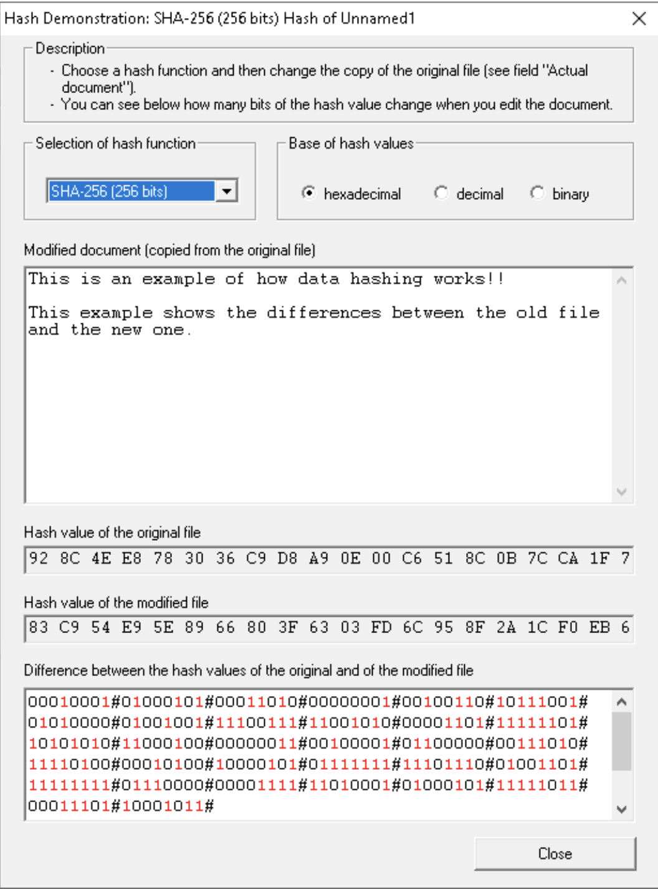
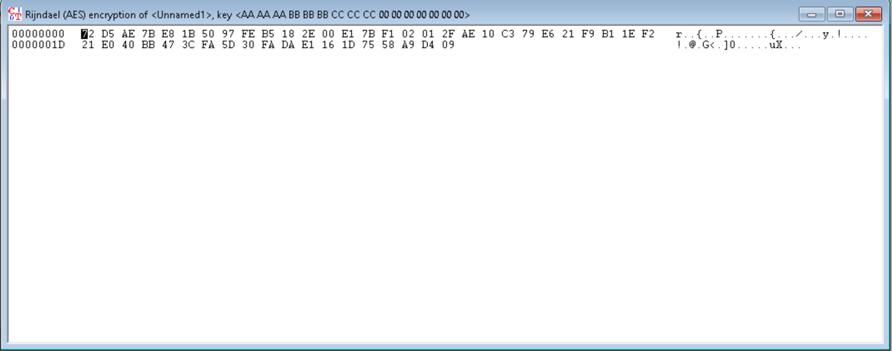
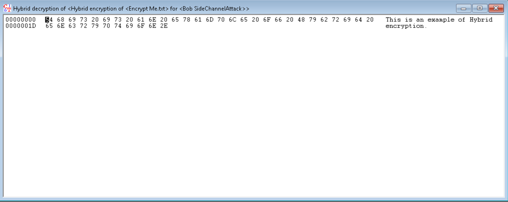

# Ethical Hacking Lab 26: Cryptography

*Hashing, Symmetric, Asymmetric, and Hybrid Encryption with CrypTool*

**Course:** IT460 Threat Hunting &nbsp;·&nbsp; **Category:** Cryptography &nbsp;·&nbsp; **Environment:** NDG Ethical Hacking v2 lab (WinOS / CrypTool)

> The full report is rendered below. A formal copy is also available for download: [**Cryptography-Report.pdf**](./Cryptography-Report.pdf)

## Outcome

- Demonstrated the SHA-256 avalanche effect for integrity verification and contrasted it with MD5's known collision weakness.
- Performed AES-CBC symmetric encryption/decryption with a shared 128-bit key and RSA asymmetric encryption with a generated key pair.
- Completed an end-to-end hybrid workflow: AES encrypted the document while RSA protected the AES session key, then the RSA private key recovered the session key to restore the plaintext.

## Skills Demonstrated

- Cryptographic Hashing and Integrity Verification
- Symmetric Encryption (AES / Rijndael)
- Asymmetric Encryption (RSA key pairs)
- Hybrid Encryption Workflow
- Algorithm and Key-Management Analysis
- Applied Cryptography Reporting

## Tools Used

- CrypTool
- MD5 and SHA-256
- AES (Rijndael, CBC)
- RSA
- Windows (WinOS)

---

## 1. Objective

The objective of this lab was to examine how cryptographic technologies protect information through hashing, symmetric encryption, asymmetric encryption, and hybrid encryption. CrypTool was used to compare MD5 and SHA-256 hashes, encrypt and decrypt information with AES, generate and use RSA keys, and complete a hybrid encryption workflow.

Cryptography provides three important security functions. **Confidentiality** prevents unauthorized individuals from reading protected information. **Integrity** allows unauthorized changes to information to be detected. **Authentication** helps verify the identity of users, systems, or message senders through mechanisms such as digital signatures, certificates, and message authentication codes.

## 2. Lab Environment

| Component | Configuration |
| --- | --- |
| Virtual machine | WinOS |
| IP address | `192.168.0.20` |
| Operating system | Microsoft Windows |
| Account | Administrator |
| Primary application | CrypTool |
| Lab materials | NDG Ethical Hacking v2 Lab 26 |
| Algorithms examined | MD5, SHA-256, AES, and RSA |

All exercises were performed within the authorized NDG lab environment.

## 3. Commands and Tools Used

No command-line commands were required. The exercises were completed through the CrypTool graphical interface.

### Tools and Algorithms

| Tool or Algorithm | Purpose |
| --- | --- |
| CrypTool | Demonstrated hashing, encryption, decryption, key generation, and hybrid cryptography. |
| MD5 | Produced a 128-bit message digest for comparison purposes. |
| SHA-256 | Produced a 256-bit message digest and demonstrated the avalanche effect. |
| AES / Rijndael | Performed symmetric encryption and decryption with a shared 128-bit key. |
| RSA | Demonstrated asymmetric encryption using a public/private key pair. |
| Hybrid encryption | Combined AES data encryption with RSA protection of the AES session key. |

### CrypTool Operations

- Generated hashes for an original and modified document.
- Selected MD5 and SHA-256 through the hash demonstration interface.
- Entered a 128-bit AES key and encrypted plaintext using AES-CBC.
- Decrypted the ciphertext using the same symmetric key.
- Generated an RSA public/private key pair.
- Encrypted data using the RSA public key and decrypted it using the private key.
- Generated an AES session key for hybrid encryption.
- Protected the AES session key using an RSA public key.
- Recovered the session key with the corresponding RSA private key.
- Decrypted the protected document with the recovered AES key.

## 4. Key Findings

### 4.1 Hashing and Data Integrity

The original document was hashed and then slightly modified. When SHA-256 was recalculated, the resulting hash was substantially different from the original hash. This occurred even though the modification was small.

This behavior is known as the **avalanche effect**: a small change in input produces a large and unpredictable change in the resulting digest. It demonstrates why cryptographic hashes are useful for integrity verification. If a file is modified after its trusted hash is recorded, the mismatch reveals that the file is no longer identical to the original.

Hashing differs from encryption because hashing is designed as a one-way process. A hash is used to identify or verify data, while encryption is reversible when the proper key is available.

### 4.2 MD5 Compared with SHA-256

MD5 generates a 128-bit digest, while SHA-256 generates a 256-bit digest. The larger output is not the only reason SHA-256 is preferred. MD5 has known collision weaknesses, meaning different inputs can be deliberately constructed to produce the same hash. It is therefore unsuitable for modern security-sensitive integrity verification.

SHA-256 provides substantially stronger collision resistance and remains part of the Secure Hash Standard defined in [NIST FIPS 180-4](https://csrc.nist.gov/pubs/fips/180-4/upd1/final).

### 4.3 Symmetric Encryption with AES

AES encryption was performed using the following 128-bit key:

```
AA AA AA BB BB BB CC CC CC 00 00 00 00 00 00 00
```

After encryption, the readable plaintext was transformed into ciphertext represented by hexadecimal values and mostly unreadable characters. The same key was required to decrypt the ciphertext and restore the original plaintext.

This demonstrates the central characteristic of symmetric cryptography: the sender and recipient must possess the same secret key. AES is fast and efficient, but the key must be protected because anyone who obtains it may be able to decrypt the data. AES is standardized in [NIST FIPS 197](https://csrc.nist.gov/pubs/fips/197/final).

### 4.4 Asymmetric Encryption with RSA

CrypTool generated an RSA public/private key pair. The public key was used to encrypt the data, while the corresponding private key was used to decrypt it.

This arrangement allows a public key to be distributed without exposing the private key. The private key must remain under the owner's control because possession of it permits decryption and may also enable the creation of valid digital signatures.

The exercise demonstrated the RSA process using the plaintext `This is RSA encryption at work`. Production implementations should use standardized padding and key-encapsulation procedures, such as those specified in [RFC 8017](https://www.rfc-editor.org/rfc/rfc8017.html), instead of attempting to implement raw RSA operations directly.

### 4.5 Hybrid Encryption

The hybrid encryption exercise combined AES and RSA through the following process:

1. CrypTool generated a temporary AES session key.
2. The document was encrypted with AES.
3. The AES session key was encrypted with the recipient's RSA public key.
4. The encrypted document and protected session key were stored together.
5. The recipient's RSA private key recovered the AES session key.
6. The recovered AES key decrypted the document.

The decrypted plaintext was `This is an example of Hybrid encryption.` Hybrid encryption is valuable because it combines the performance of symmetric encryption with the key-distribution advantages of asymmetric encryption. Similar designs are used in HTTPS, virtual private networks, secure messaging applications, and other encrypted communication systems.

## 5. Lab Procedure and Results

### 5.1 Hash Comparison

The original text was hashed using SHA-256. Additional text was then added to the document and a second hash was calculated. The resulting hashes were visibly different, and CrypTool highlighted numerous changed bits.

**Result:** The modified file produced a different digest, successfully demonstrating integrity verification and the avalanche effect.

### 5.2 AES Encryption and Decryption

The plaintext was encrypted using AES-CBC and a manually supplied 128-bit symmetric key. The encryption output appeared as hexadecimal ciphertext with no readable resemblance to the original data. Applying the same algorithm and key reversed the process.

**Result:** AES successfully protected the confidentiality of the plaintext and restored it when the correct shared key was supplied.

### 5.3 RSA Encryption and Decryption

CrypTool generated a public key and a corresponding private key. The public key encrypted the test data, and the private key recovered the plaintext.

**Result:** The test demonstrated that encryption can occur without sharing the private key. Only the holder of the corresponding private key could complete the demonstrated decryption operation.

### 5.4 Hybrid Encryption and Decryption

The file Encrypt Me.txt was protected with a randomly generated AES session key. The session key was then encrypted for the selected RSA recipient. During decryption, the recipient's private key recovered the session key, allowing AES to restore the document.

**Result:** The original plaintext was successfully recovered, verifying the complete hybrid workflow.

## 6. Analysis of the Cryptographic Process

### Phase 1: Hashing and Integrity

Hashing generated a fixed-length digital representation of the document. When the document was modified, SHA-256 produced an entirely different result. This makes comparison of trusted hashes an effective way to detect file corruption or unauthorized modification.

A hash alone does not prove who created the data. Authentication normally requires an additional mechanism, such as a keyed hash, trusted digital signature, or certificate.

### Phase 2: Comparing Algorithms

Both MD5 and SHA-256 produced fixed-length output and demonstrated the avalanche effect. However, MD5 is obsolete for collision-resistant security applications. SHA-256 has a larger digest and substantially stronger collision resistance under current standards.

The exercise showed why algorithm selection must consider known cryptographic weaknesses rather than relying only on whether an algorithm produces output that appears random.

### Phase 3: Symmetric Encryption

AES provided rapid encryption of the document using one shared secret key. This is efficient for encrypting large quantities of data, but it introduces a key-distribution problem. The secret key must reach the authorized recipient without being exposed to an attacker.

The exercise used AES-CBC to demonstrate confidentiality. In a production environment, CBC encryption should be combined with a message authentication mechanism. An authenticated-encryption mode such as AES-GCM can provide confidentiality and integrity together, as described in [NIST SP 800-38D](https://csrc.nist.gov/pubs/sp/800/38/d/final).

### Phase 4: Asymmetric Encryption

RSA addressed the key-distribution problem by separating the encryption and decryption keys. A public key could be shared openly, while the private key remained protected. This eliminated the need to distribute the private key to anyone wishing to send encrypted information to its owner.

RSA is more computationally expensive than AES, making it inefficient for directly encrypting large files.

### Phase 5: Hybrid Encryption

Hybrid encryption used each algorithm for the task it performs most effectively. AES efficiently encrypted the document, while RSA protected the relatively small AES session key. This provides the speed of symmetric encryption, the key-management benefits of asymmetric encryption, the ability to encrypt data for a particular recipient, and reduced exposure of the session key during transmission or storage. The completed decryption showed that the private RSA key recovered the session key and that the session key restored the protected document.

## 7. Why Cryptography Matters

Cryptography is critical because organizations routinely store and transmit passwords, financial information, personal records, intellectual property, and authentication data. Without strong cryptographic controls, intercepted or stolen information may be immediately readable.

Weak hashing algorithms can enable collisions or accelerate compromise when they are misused for password storage. Weak encryption and poor key management can expose otherwise protected data. Strong, properly implemented cryptography helps preserve confidentiality, detect unauthorized modification, and support trusted authentication.

## 8. Security Analysis

The lab demonstrated that cryptographic protection depends on more than simply selecting an algorithm. The implementation, operating mode, key length, key generation method, and key-storage process are equally important.

AES is considered strong when used correctly, but exposure of the shared key defeats its confidentiality. RSA depends on protection of the private key and the use of adequate key sizes and secure padding. Hash algorithms must remain resistant to collision and preimage attacks.

The hybrid model offers an effective balance because bulk data can be encrypted efficiently without directly sharing the symmetric key. However, the recipient's public key must be authenticated. Otherwise, an attacker could substitute a different public key and cause the session key to be encrypted for the attacker.

## 9. Reflection

This lab demonstrated how different cryptographic mechanisms solve different security problems. Hashing detects changes but does not conceal information. AES efficiently protects confidentiality but requires both parties to possess the same secret. RSA reduces the shared-key distribution problem but is less efficient for large amounts of data. Hybrid encryption combines these techniques to create a more practical real-world solution.

The most important lesson was that cryptography should be designed as a complete process. Secure algorithms cannot compensate for exposed keys, outdated hash functions, missing authentication, or improper implementation.

## 10. Basic Defense and Recommendations

1. Use SHA-256 or a stronger approved hash algorithm for general integrity verification.
2. Do not use MD5 for security-sensitive integrity checks or digital signatures.
3. Store passwords using purpose-built password-hashing functions such as Argon2id, bcrypt, scrypt, or PBKDF2 with unique salts.
4. Use authenticated encryption, such as AES-GCM, when both confidentiality and integrity are required.
5. Generate cryptographic keys with a cryptographically secure random-number generator.
6. Protect secret and private keys in a secure key vault, hardware security module, or similarly controlled location.
7. Restrict access to keys, rotate them according to policy, and maintain secure recovery procedures.
8. Validate public keys through trusted certificates or another authenticated mechanism.
9. Use standardized RSA padding, such as RSA-OAEP, and an approved RSA key size.
10. Use established cryptographic libraries and protocols rather than designing custom encryption systems.

## 11. Evidence

**Figure 1.1 — SHA-256 Hash Comparison Demonstrating the Avalanche Effect**

The figure shows CrypTool comparing the original document with a modified version. The original and modified SHA-256 values are different, and the lower comparison pane highlights numerous changed bits. This confirms that even a small modification results in a substantially different digest and can therefore be detected through integrity verification.



**Figure 2.1 — AES-CBC Encryption Output Using a 128-Bit Symmetric Key**

The figure shows the Rijndael/AES encryption result produced with the 128-bit key AA AA AA BB BB BB CC CC CC 00 00 00 00 00 00 00. The plaintext has been transformed into hexadecimal ciphertext and is no longer meaningfully readable, demonstrating confidentiality through symmetric encryption.



**Figure 2.2 — Successful Hybrid RSA-AES Decryption Restoring the Original Plaintext**

The figure shows the completed hybrid decryption output. The plaintext "This is an example of Hybrid encryption." was successfully restored. This result verifies the end-to-end workflow in which RSA protected the AES session key and AES encrypted and decrypted the document.


