# IT460 Final Project: Penetration Testing Assessment

*Gray-Box Web Application Penetration Test — OWASP Broken Web Applications / NetLab Sandbox*

**Course:** IT460 Threat Hunting &nbsp;·&nbsp; **Category:** Penetration Testing &nbsp;·&nbsp; **Environment:** NetLab Cyber Range (Kali Linux / OWASP BWA)

> The full report is rendered below. A formal copy is also available for download: [**Final-Penetration-Test-Report.pdf**](./Final-Penetration-Test-Report.pdf)

## Outcome

- SQL injection against OWASP Mutillidae returned 24 account records with plaintext credentials; the disclosed admin credential authenticated successfully to the application.
- OS command injection executed arbitrary commands as the Apache service account (www-data) through the DNS lookup function without authentication.
- Seven findings documented across two Critical, two High, and three Medium severities, with a prioritized remediation roadmap and retest acceptance criteria.

## Skills Demonstrated

- Gray-Box Penetration Testing
- Web Application Enumeration (Nmap, WhatWeb, Nikto)
- SQL Injection Identification and Validation
- OS Command Injection Identification and Validation
- Web Server Misconfiguration Analysis
- SMB Security Assessment
- Penetration Test Reporting and CVSS Scoring

## Tools Used

- Kali Linux
- Nmap 7.80
- WhatWeb
- Nikto 2.1.6
- Firefox (manual validation)
- OWASP Mutillidae II
- DVWA (Damn Vulnerable Web Application)

---

## Penetration Testing Assessment

**IT460 · FINAL PROJECT**

**Prepared by:** Justin Martin &nbsp;·&nbsp; **Course:** IT460 &nbsp;·&nbsp; **Assessment Date:** August 23, 2026

**Assessment Window:** 17:08–17:40 EDT (approximate) &nbsp;·&nbsp; **Classification:** Educational / Controlled Lab

**Authorization:** All activity described in this report was performed inside the assigned NetLab Cyber Range against the intentionally vulnerable OWASP BWA host. No public Internet targets were tested.

---

## Executive Summary

The assessment confirmed that the OWASP Broken Web Applications host is critically exposed to server-side injection. Two independent attack paths were validated: SQL injection disclosed 24 account records and plaintext passwords, and operating-system command injection executed commands as the Apache service account (www-data). Either condition can enable rapid compromise; together they demonstrate ineffective input handling and inadequate separation between the application and its host operating system.

The host also exposed a DVWA database reset function without an authenticated administrative session, numerous unsupported software components, legacy SMB services with message signing disabled, verbose database errors, directory listings, unsafe HTTP methods, and missing browser security controls. The environment is intentionally vulnerable for training, but the same conditions in production would warrant immediate containment and rebuild.

**Risk at a glance:** 7 total findings — 2 Critical, 2 High, 3 Medium

**Immediate priorities:**

Removal of the affected web application from any untrusted network until injection flaws are corrected and retested. Invalidation of exposed credentials, required password changes, and migration of password storage to a modern salted adaptive hash. A rebuild of the host on supported software rather than piecemeal patching of the legacy stack. Restriction of administrative and setup functions and legacy services to trusted management networks only.

**Overall risk: CRITICAL.** Exploitation required only normal web access and crafted input. No authentication, special privileges, or user interaction was required for the two principal attack paths.

---

## 01 / Engagement Overview

| | |
| --- | --- |
| **Objective** | Identify and validate exploitable weaknesses on the OWASP BWA host and provide actionable remediation guidance. |
| **Assessment type** | Gray-box penetration test with limited architecture knowledge and no application credentials at the start. |
| **Source** | Kali Linux, 192.168.9.2/24, simulated WAN segment. |
| **Target** | OWASP Broken Web Applications, 192.168.68.12/24, DMZ segment. |
| **Timing** | August 23, 2026; approximately 17:08–17:40 EDT. |
| **Authorization** | Assigned NetLab Cyber Range only; controlled educational environment. |

### Scope and Constraints

**In scope:** OWASP BWA host (192.168.68.12), hosted HTTP applications, DMZ host/service discovery, safe validation of web flaws.

**Out of scope:** Public Internet, pfSense administration, protected LAN hosts, DoS, persistence, destructive changes, or data deletion.

Testing was designed to demonstrate risk while minimizing impact. Only the intentionally vulnerable target was actively assessed. Database reset was used solely within DVWA's purpose-built setup workflow; no unrelated systems or user data were altered.

---

## 02 / Environment and Network Path

**Figure 2.1 — Simplified Assessment Path and Scope Boundary**

The figure depicts the network topology used during the assessment, showing the Kali source host on the simulated WAN segment (192.168.9.0/24), the pfSense gateway, the DMZ segment (192.168.68.0/24) containing the OWASP BWA target, and the protected LAN (192.168.0.0/24) excluded from active testing.

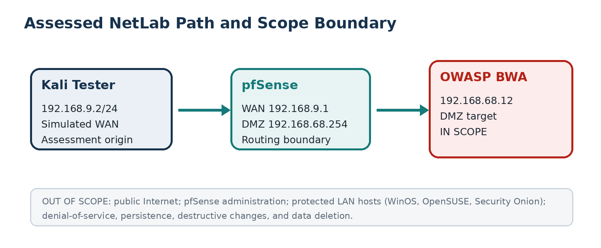

**Figure 2.2 — Kali Interface and Routing Context**

The figure shows the Kali Linux interface configuration and routing table captured before testing began, confirming that eth0 held the address 192.168.9.2/24 and that the default gateway was 192.168.9.1.

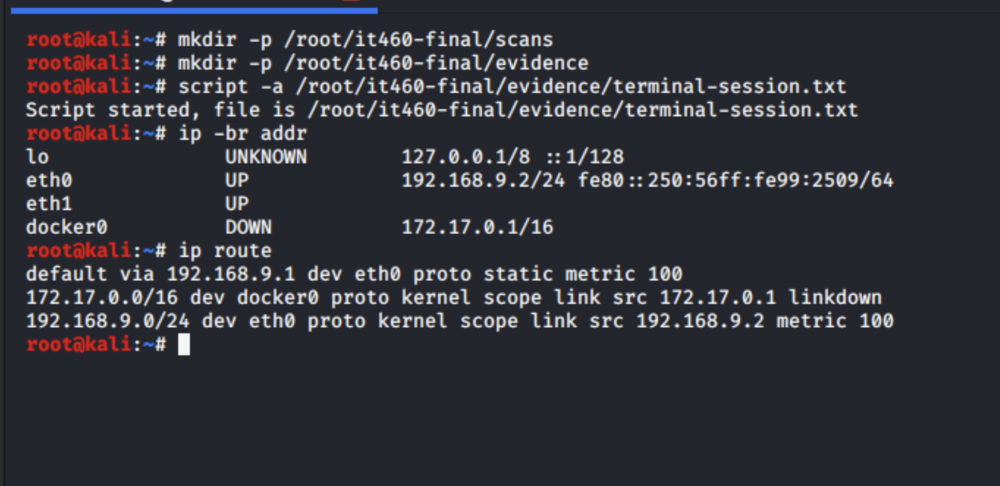

The Kali host had a single IPv4 address on eth0 (192.168.9.2/24) and used 192.168.9.1 as its default gateway. The target resided two routed hops away in the 192.168.68.0/24 DMZ. The protected 192.168.0.0/24 LAN was intentionally excluded from active testing.

---

## 02 / Testing Methodology

| Step | Phase | Description |
| --- | --- | --- |
| **1** | **Prepare** | Created a dedicated evidence directory and terminal transcript; confirmed source addressing and routing. |
| **2** | **Discover** | Confirmed the DMZ target and used host discovery cautiously across the authorized range. |
| **3** | **Enumerate** | Ran a full TCP port scan, then service/version detection and safe default scripts. |
| **4** | **Fingerprint** | Used WhatWeb and Nikto to identify the web stack, exposed paths, headers, and configuration weaknesses. |
| **5** | **Validate** | Manually reproduced SQL injection and command injection in Mutillidae and tested DVWA setup access. |
| **6** | **Analyze** | Correlated manual proof with scan evidence, rated findings, and produced prioritized remediation. |

**Core tools:** Nmap 7.80 for TCP discovery, service/version detection, OS inference, and safe NSE checks. WhatWeb for web technology fingerprinting and exposed metadata review. Nikto 2.1.6 for web server misconfiguration and outdated-component checks. Firefox for manual application validation and evidence capture.

**Evidence standard:** A finding was marked Validated only when the behavior was reproduced manually or directly supported by deterministic scan output. Scanner-only observations remain qualified in the narrative.

---

## 03 / Summary of Findings

| ID | Finding | Severity | CVSS* | Status |
| --- | --- | --- | --- | --- |
| **F-01** | SQL Injection and Plaintext Credential Disclosure | **Critical** | 9.8 | Validated |
| **F-02** | Operating-System Command Injection | **Critical** | 9.8 | Validated |
| **F-03** | Unauthenticated DVWA Database Reset Function | **High** | 8.1 | Validated |
| **F-04** | Unsupported and Severely Outdated Components | **High** | 8.1 | Observed |
| **F-05** | Web Server Security Misconfiguration | **Medium** | 6.5 | Observed |
| **F-06** | Verbose Error and Internal Path Disclosure | **Medium** | 5.3 | Validated |
| **F-07** | SMB Message Signing Disabled | **Medium** | 5.9 | Observed |

\* Estimated CVSS v3.1 base score used for prioritization in this controlled lab.

**Figure 3.1 — Full TCP Scan Summary**

The figure shows the Nmap full TCP scan output confirming nine open services on the OWASP BWA target at 192.168.68.12, including HTTP (80, 8080, 8081), HTTPS (443), SSH (22), NetBIOS/SMB (139, 445), IMAP (143), and a Java object service (5001).

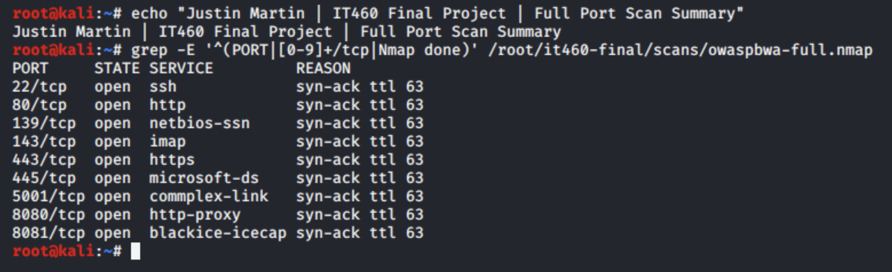

---

## 03 / Validated Attack Narrative

The assessment established a short, repeatable path from network access to application and host compromise. The attack did not depend on phishing, credentials, or endpoint access.

| Step | Phase | Result |
| --- | --- | --- |
| **01** | **Reach target** | Kali reached 192.168.68.12 through pfSense from the simulated WAN. |
| **02** | **Enumerate** | Nine TCP services were exposed, including multiple web stacks and legacy SMB. |
| **03** | **Fingerprint** | Apache 2.2.14, PHP 5.3.2, OpenSSL 0.9.8k, Jetty, and Tomcat were identified. |
| **04** | **Inject** | SQL injection returned 24 account records; command injection ran as www-data. |
| **05** | **Escalate access** | Disclosed admin credentials successfully authenticated to Mutillidae. |

**Business consequence:** An external attacker with only HTTP reachability could obtain reusable credentials and execute commands in the web server context. Those capabilities create credible paths to data theft, application tampering, service disruption, and lateral movement.

---

## 04 / Detailed Findings

### F-01 — SQL Injection and Plaintext Credential Disclosure

**Severity: Critical &nbsp;·&nbsp; CVSS: 9.8 &nbsp;·&nbsp; Status: Validated &nbsp;·&nbsp; Asset: OWASP BWA / 192.168.68.12**

#### Description

The Mutillidae account-details function concatenated untrusted input into a SQL query. Supplying a tautology caused the application to return every matching record instead of a single account. The response exposed 24 account records with plaintext passwords, including the administrative account.

#### Proof of Concept

Navigate to OWASP 2013 → A1 Injection (SQL) → SQLi -- Extract Data → User Info. Enter the payload `' OR 1=1 #` in the Name field, enter `test` as the password, and select View Account Details.

**Figure F-01.1 — SQL Injection Returned 24 Account Records**

The figure shows the Mutillidae User Info page after submission of the tautology payload. The application returned 24 account records with plaintext usernames and passwords, including the administrative account.

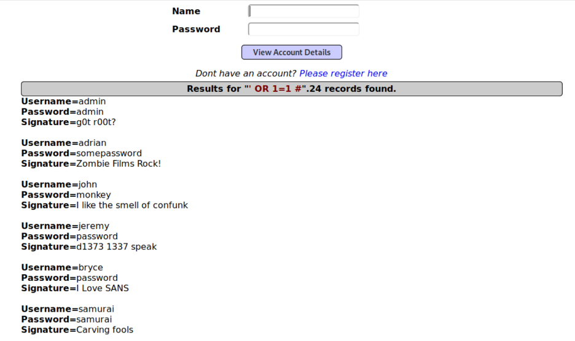

**Figure F-01.2 — Disclosed Admin Credential Authenticated Successfully**

The figure shows the Mutillidae login page confirming that the admin/admin credential disclosed through SQL injection authenticated to the application, demonstrating immediate account takeover capability.

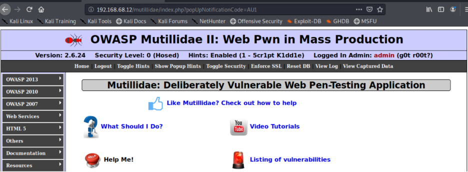

#### Impact

The flaw permits bulk disclosure of application credentials and immediate account takeover. Because passwords were returned in plaintext, any credential reuse could extend the impact beyond the application. Administrative access was confirmed using the exposed account.

#### Recommended Remediation

Replace dynamic SQL concatenation with parameterized queries or prepared statements for every data access path. Store passwords only as salted adaptive hashes such as Argon2id, bcrypt, scrypt, or PBKDF2; never return password values to the client. Invalidate and rotate all exposed credentials, enforce unique passwords, and require MFA for administrative accounts. Apply least-privilege database permissions and alert on tautologies, comments, and abnormal multi-record responses. Retest all account lookup, authentication, and search functions with automated and manual injection cases.

---

### F-02 — Operating-System Command Injection

**Severity: Critical &nbsp;·&nbsp; CVSS: 9.8 &nbsp;·&nbsp; Status: Validated &nbsp;·&nbsp; Asset: OWASP BWA / 192.168.68.12**

#### Description

The Mutillidae DNS lookup function passed user-controlled input to an operating-system shell. Shell metacharacters appended additional commands to the intended lookup. The server executed `whoami` and `id` and returned their output in the HTTP response.

#### Proof of Concept

Navigate to OWASP 2013 → A1 Injection (Other) → Command Injection → DNS Lookup. Submit the following value as the hostname/IP: `127.0.0.1 && whoami && id`

**Figure F-02.1 — Server-Side Command Execution Returned www-data**

The figure shows the Mutillidae DNS Lookup page response after submission of the command-injection payload. The server executed the appended commands and returned the output `www-data` and `uid=33(www-data)` in the HTTP response, confirming arbitrary command execution as the Apache service account.

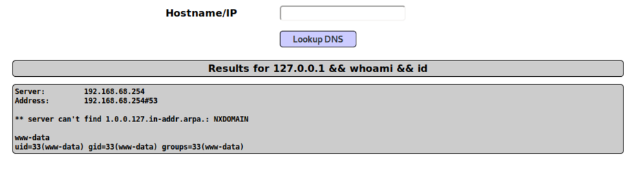

#### Impact

An unauthenticated attacker can execute arbitrary commands with the privileges of the Apache service account. This can expose application secrets, permit file modification, establish a foothold, and support lateral movement. The demonstrated user was not root, but web-service access is sufficient for substantial application and data compromise.

#### Recommended Remediation

Remove shell execution from the lookup workflow and call a purpose-built DNS resolver library instead. Apply strict allowlisting for valid hostnames and IP addresses before any backend operation. Run the web service with minimal filesystem and network privileges and confine it with mandatory access controls. Treat escaping as defense in depth only; do not rely on escaping to make shell construction safe. Review logs for command separators and unexpected child processes, then retest with common shell metacharacters.

---

### F-03 — Unauthenticated DVWA Database Reset Function

**Severity: High &nbsp;·&nbsp; CVSS: 8.1 &nbsp;·&nbsp; Status: Validated &nbsp;·&nbsp; Asset: OWASP BWA / 192.168.68.12**

#### Description

The DVWA setup page was reachable without an authenticated application session. Although normal DVWA login attempts failed, the setup workflow allowed the database to be created or reset and reported successful recreation of the users and guestbook tables.

**Figure F-03.1 — DVWA Setup Reported Successful Database and Table Recreation**

The figure shows the DVWA setup page confirming that the database and tables were recreated through the unauthenticated setup workflow, demonstrating that the maintenance function was accessible without an established administrative session.

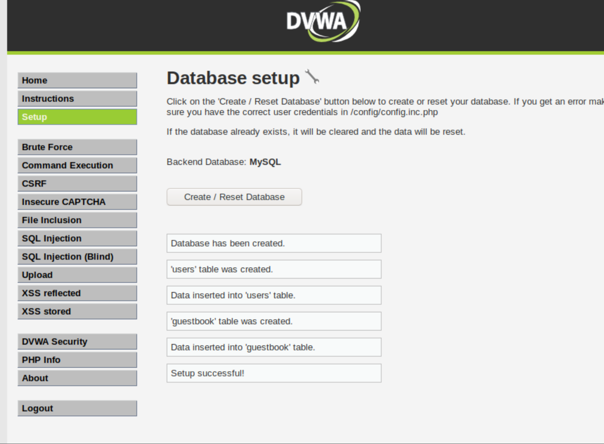

#### Impact

An exposed reset function can destroy application state, restore default accounts, and interrupt service. In this lab the action affected only the deliberately vulnerable DVWA database; in a production design, an equivalent unauthenticated maintenance endpoint would create serious integrity and availability risk.

#### Recommended Remediation

Require an authenticated administrative session and explicit authorization for all setup and reset actions. Remove installation and setup scripts after deployment or restrict them to a dedicated management network. Require CSRF protection, reauthentication, and a clear confirmation step for destructive administrative actions. Log every reset attempt and alert when the function is invoked outside an approved maintenance window.

---

### F-04 — Unsupported and Severely Outdated Components

**Severity: High &nbsp;·&nbsp; CVSS: 8.1 &nbsp;·&nbsp; Status: Observed &nbsp;·&nbsp; Asset: OWASP BWA / 192.168.68.12**

#### Description

Service enumeration identified a legacy Linux and web application stack. Observable components included Apache 2.2.14, PHP 5.3.2, OpenSSL 0.9.8k, OpenSSH 5.3p1, Python 2.6.5, Perl 5.10.1, Jetty 6.1.25, an older Tomcat/Coyote engine, and a Linux 2.6.32 kernel. Nikto independently reported multiple components as outdated.

**Figure F-04.1 — WhatWeb Fingerprinted the Legacy Stack**

The figure shows WhatWeb output identifying the Apache, PHP, OpenSSL, Python, Perl, and Passenger versions present on the target, all of which represent end-of-life components with accumulated publicly known vulnerabilities.

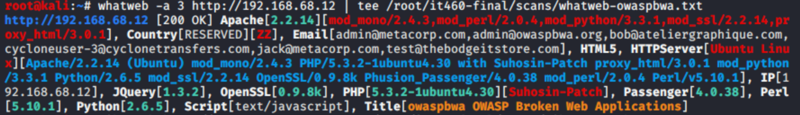

#### Impact

Unsupported components accumulate publicly known vulnerabilities and may no longer receive security fixes. Exact exploitability depends on build options and configuration, but the breadth and age of the observed stack materially increase the likelihood of remote compromise and make safe maintenance impractical.

#### Recommended Remediation

Rebuild the host on a supported operating system and supported web/application runtimes rather than patching the legacy image in place. Maintain a component inventory or SBOM with ownership, version, support status, and patch deadlines. Remove unused runtimes, modules, and listeners to reduce the attack surface. Establish recurring authenticated vulnerability scans and patch compliance reporting.

---

### F-05 — Web Server Security Misconfiguration

**Severity: Medium &nbsp;·&nbsp; CVSS: 6.5 &nbsp;·&nbsp; Status: Observed &nbsp;·&nbsp; Asset: OWASP BWA / 192.168.68.12**

#### Description

The web tier exposed multiple defense-in-depth weaknesses. Nikto and Nmap reported TRACE enabled, directory indexing, an exposed phpMyAdmin path, cookies without HttpOnly, a permissive crossdomain.xml policy, missing browser security headers, and internal address information in a Location response. These issues increase information leakage and make exploitation of other weaknesses easier.

**Figure F-05.1 — Nikto Evidence for Misconfiguration**

The figure shows Nikto output identifying missing security headers, directory indexing, a permissive cross-domain policy, and exposed server metadata on the OWASP BWA target.

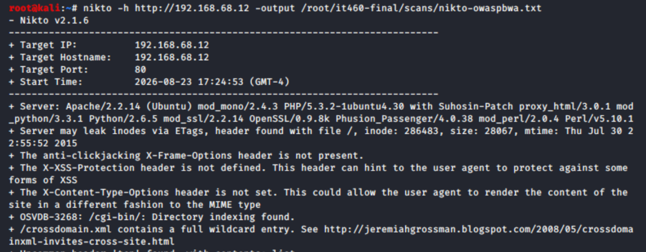

#### Impact

Individually, these settings may not provide direct compromise. In combination they improve attacker reconnaissance, expose sensitive administration interfaces, weaken session protection, and increase the impact of browser-side flaws such as clickjacking and content-type confusion.

#### Recommended Remediation

Disable TRACE and all HTTP methods not required by the application. Disable directory listings and remove sample, test, icon, and documentation directories from production. Restrict phpMyAdmin to trusted management hosts or remove it from the web tier. Set Secure, HttpOnly, and SameSite attributes on session cookies and deploy a restrictive Content-Security-Policy. Add `X-Content-Type-Options: nosniff` and CSP frame-ancestors; eliminate wildcard cross-domain policy entries.

---

### F-06 — Verbose Error and Internal Path Disclosure

**Severity: Medium &nbsp;·&nbsp; CVSS: 5.3 &nbsp;·&nbsp; Status: Validated &nbsp;·&nbsp; Asset: OWASP BWA / 192.168.68.12**

#### Description

A malformed SQL injection attempt triggered a detailed application exception. The response exposed the local path to MySQLHandler.php, source line numbers, MySQL error 1064, client version 5.1.73, local UNIX-socket usage, the generated query, and a multi-frame stack trace.

**Figure F-06.1 — Application Disclosed Internal Paths and Stack Trace**

The figure shows the Mutillidae error page produced by a malformed injection attempt, exposing the filesystem path to MySQLHandler.php, query text, MySQL version details, and a full stack trace.

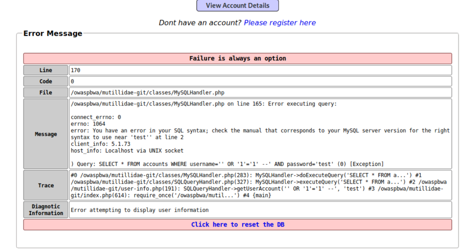

#### Impact

Verbose errors help attackers understand query structure, application layout, libraries, and database behavior. This information reduces the time required to refine injection payloads and identify additional attack paths.

#### Recommended Remediation

Return generic error messages to clients and record diagnostic detail only in protected server-side logs. Disable debug and stack-trace output in production configurations. Use centralized logging with access control, retention, correlation identifiers, and alerting. Review all exception handlers to prevent disclosure of paths, queries, connection details, and library versions.

---

### F-07 — SMB Message Signing Disabled

**Severity: Medium &nbsp;·&nbsp; CVSS: 5.9 &nbsp;·&nbsp; Status: Observed &nbsp;·&nbsp; Asset: OWASP BWA / 192.168.68.12**

#### Description

Ports 139 and 445 exposed Samba services. The Nmap `smb-security-mode` script reported user-level authentication, guest account use, challenge-response support, and message signing disabled. SMB2 negotiation failed, suggesting reliance on older protocol behavior.

**Figure F-07.1 — Nmap Reported SMB Message Signing Disabled**

The figure shows Nmap SMB security-mode script output confirming that message signing is disabled on the target's Samba service and that SMB2 negotiation failed, indicating legacy protocol reliance.

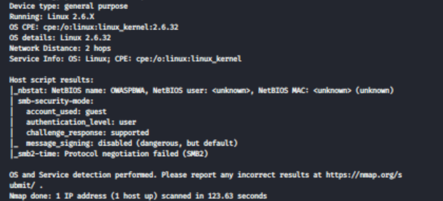

#### Impact

Unsigned SMB traffic can be modified or relayed by an attacker with an appropriate network position. Legacy protocol support and guest access further increase exposure. The assessment did not perform credential relay or destructive SMB testing.

#### Recommended Remediation

Require SMB signing on both clients and servers and verify enforcement through policy and testing. Disable SMB1 and other legacy dialects; update Samba to a supported release. Disable guest access unless there is a documented business requirement. Restrict ports 139 and 445 to explicitly authorized segments and block them at external boundaries.

---

## 05 / Remediation Roadmap

| Priority | Target Window | Action | Validation Evidence |
| --- | --- | --- | --- |
| **P0** | 0–24 hours | Isolate the application; block untrusted access; rotate exposed credentials. | Access control test and credential invalidation record |
| **P0** | 0–72 hours | Correct SQL and command injection; remove unauthenticated setup/reset access. | Peer-reviewed code change and negative retest |
| **P1** | 7 days | Rebuild on supported OS, web server, runtime, crypto, and application components. | New inventory, authenticated scan, and patch report |
| **P1** | 14 days | Harden HTTP, cookies, errors, phpMyAdmin exposure, directory listings, and allowed methods. | Header/path review and repeat Nikto/Nmap results |
| **P2** | 30 days | Require SMB signing, remove legacy dialects/guest access, and restrict network reachability. | Policy export and SMB security-mode retest |
| **P2** | Ongoing | Add secure coding gates, dependency tracking, logging, alerting, and quarterly validation. | CI evidence, SBOM, alert test, and recurring assessment record |

### Retest Acceptance Criteria

Injection payloads are rejected or treated as data; no database rows or command output are exposed. No setup, reset, or administrative function is available without authenticated authorization. All externally reachable components are supported, inventoried, and patched to approved baselines. TRACE, directory listing, verbose errors, and unneeded management paths are unavailable. SMB signing is required, guest access is disabled, and legacy dialect negotiation fails closed.

---

## 06 / Conclusion

The assessment met its objective by identifying the reachable services on the OWASP BWA target, fingerprinting the application stack, validating two critical injection flaws, documenting additional material weaknesses, and producing a prioritized remediation plan. The most important result is not the number of findings; it is the demonstrated ability to move from ordinary HTTP access to credential disclosure, administrative login, and server-side command execution.

The environment should be considered unsafe for any real data or production use. If this were a live system, immediate containment and a supported-platform rebuild would be more reliable than piecemeal remediation of the legacy stack. After corrective work, an independent retest should verify each acceptance criterion and confirm that compensating controls do not merely hide the vulnerable code paths.

### Professional Reflection

This project reinforced the importance of treating automated scan output as a starting point rather than a finished assessment. Nmap, WhatWeb, and Nikto established the attack surface, but the strongest evidence came from controlled manual validation: the SQL injection returned real records, the disclosed credential authenticated successfully, and command injection returned the web service identity. The work also demonstrated why scope discipline matters. The network contained additional systems, but the report remained focused on the authorized DMZ target and avoided disruptive techniques. Capturing concise evidence throughout the engagement made it possible to connect each technical observation to a reproducible proof, a concrete impact statement, and a practical remediation.

**Final assessment:** The OWASP BWA target presents CRITICAL risk by design. The validated paths are fully reproducible within the assigned lab and directly support the remediation priorities in this report.

---

## Appendix A — Observed Services

| Port | Service | Observed Detail |
| --- | --- | --- |
| **22/tcp** | SSH | OpenSSH 5.3p1 Debian 3ubuntu4 |
| **80/tcp** | HTTP | Apache httpd 2.2.14; PHP 5.3.2; TRACE enabled |
| **139/tcp** | NetBIOS/SMB | Samba smbd 3.X–4.X |
| **143/tcp** | IMAP | Courier Imapd (released 2008) |
| **443/tcp** | HTTPS | TLS-enabled web service; exact product uncertain |
| **445/tcp** | SMB | Samba smbd 3.X–4.X; signing disabled |
| **5001/tcp** | Java object service | Java Object Serialization |
| **8080/tcp** | HTTP | Apache Tomcat/Coyote JSP engine 1.1 |
| **8081/tcp** | HTTP | Jetty 6.1.25; TRACE enabled |

Service identification is based on Nmap responses and banners. Where the response was ambiguous, the description remains qualified rather than asserting a definitive product.

---

## Appendix B — Reproduction and Evidence Index

| Purpose | Command or Input |
| --- | --- |
| **Network context** | `ip -br addr` · `ip route` |
| **Full TCP scan** | `nmap -Pn -p- -T4 --min-rate 1000 --reason 192.168.68.12 -oA /root/it460-final/scans/owaspbwa-full` |
| **Service enumeration** | `nmap -Pn -sC -sV -O --version-all 192.168.68.12 -oA /root/it460-final/scans/owaspbwa-services` |
| **Web fingerprint** | `whatweb -a 3 http://192.168.68.12 \| tee /root/it460-final/scans/whatweb-owaspbwa.txt` |
| **Web scan** | `nikto -h http://192.168.68.12 -output /root/it460-final/scans/nikto-owaspbwa.txt` |
| **SQL injection** | Mutillidae User Info: Name = `' OR 1=1 #` ; Password = `test` |
| **Command injection** | Mutillidae DNS Lookup: `127.0.0.1 && whoami && id` |

Evidence handling notes: Nmap output was saved in normal, XML, and grepable formats using `-oA`. A terminal transcript was started before testing to preserve command context. Screenshots were captured immediately after deterministic results appeared. Dates displayed by lab systems reflect the configured cyber-range clock.

---

## Appendix C — References

1. [OWASP Mutillidae II Project](https://owasp.org/www-project-mutillidae-ii/)
2. [Damn Vulnerable Web Application (DVWA)](https://github.com/digininja/DVWA)
3. [OWASP SQL Injection Prevention Cheat Sheet](https://cheatsheetseries.owasp.org/cheatsheets/SQL_Injection_Prevention_Cheat_Sheet.html)
4. [OWASP OS Command Injection Defense Cheat Sheet](https://cheatsheetseries.owasp.org/cheatsheets/OS_Command_Injection_Defense_Cheat_Sheet.html)
5. [OWASP Password Storage Cheat Sheet](https://cheatsheetseries.owasp.org/cheatsheets/Password_Storage_Cheat_Sheet.html)
6. [OWASP Error Handling Cheat Sheet](https://cheatsheetseries.owasp.org/cheatsheets/Error_Handling_Cheat_Sheet.html)
7. [OWASP HTTP Headers Cheat Sheet](https://cheatsheetseries.owasp.org/cheatsheets/HTTP_Headers_Cheat_Sheet.html)
8. [OWASP Top 10: Vulnerable and Outdated Components](https://owasp.org/Top10/2021/A06_2021-Vulnerable_and_Outdated_Components/)
9. [Nmap Reference Guide](https://nmap.org/book/man.html)
10. [Microsoft SMB Signing Overview](https://learn.microsoft.com/en-us/windows-server/storage/file-server/smb-signing-overview)

*Source materials: IT460 Final Project instructions (course-provided DOCX); NDG Ethical Hacking v2 Cyber Range guide (course-provided PDF); and assessment evidence captured from the assigned NetLab environment on August 23, 2026.*
