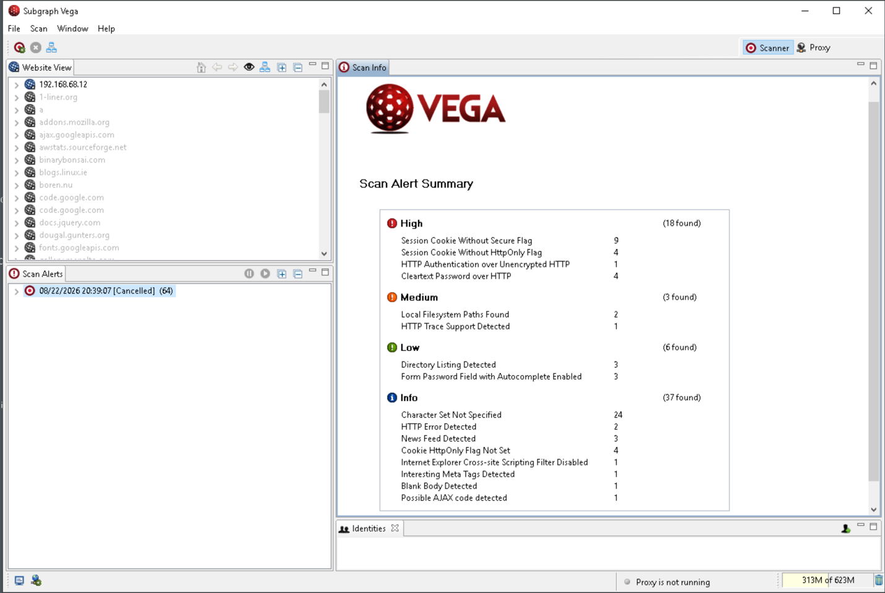
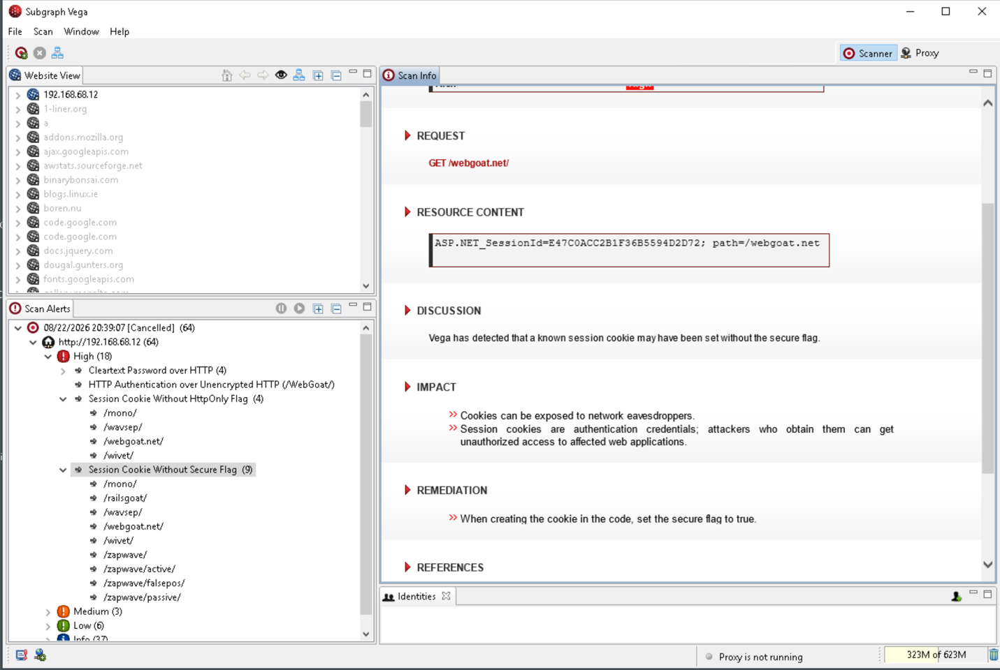
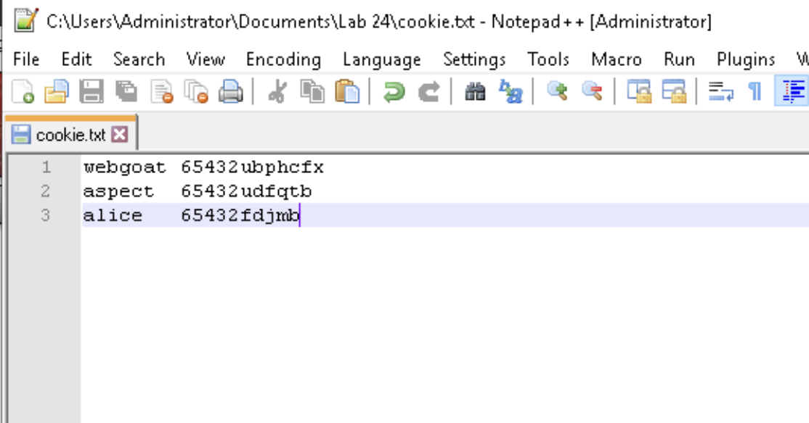
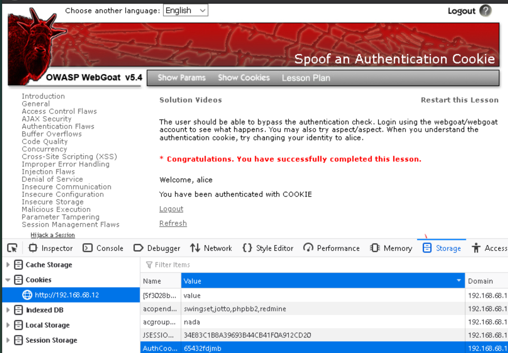

# Ethical Hacking Lab 24: Web-Based Hacking

*Web Application Vulnerability Scanning and Authentication-Cookie Spoofing*

**Course:** IT460 Threat Hunting &nbsp;·&nbsp; **Category:** Web Application Security &nbsp;·&nbsp; **Environment:** Isolated virtual network (OWASP BWA / WebGoat)

> The full report is rendered below. A formal copy is also available for download: [**Web-Based-Hacking-Report.pdf**](./Web-Based-Hacking-Report.pdf)

## Outcome

- Scanned the OWASP BWA server with Subgraph Vega, surfacing 64 alerts including 18 high-severity session and transport weaknesses (missing Secure/HttpOnly flags, cleartext authentication).
- Reverse-engineered WebGoat's predictable authentication-cookie scheme (static `65432` prefix plus the reversed, character-shifted username).
- Forged the cookie `65432fdjmb` to impersonate the `alice` account, achieving authentication bypass with no password or legitimate session.

## Skills Demonstrated

- Web Application Vulnerability Scanning
- Session and Cookie Security Analysis
- Authentication-Cookie Reverse Engineering
- Cookie Spoofing and Authentication Bypass
- Client-Side Session Manipulation
- Security Findings Reporting

## Tools Used

- Subgraph Vega
- Mozilla Firefox (Storage Inspector)
- OWASP WebGoat v5.4
- OWASP Broken Web Applications (BWA)
- Notepad++

---

## 1. Objective

The objective of this lab was to evaluate web-application security through vulnerability scanning and session-cookie manipulation. Subgraph Vega was used to scan the OWASP Broken Web Applications server for web vulnerabilities and insecure configurations. OWASP WebGoat was then used to analyze a predictable authentication-cookie scheme, construct a forged cookie, and impersonate another user without knowledge of that user's password.

Web-based hacking targets the application layer rather than the underlying operating system. Automated scanners such as Vega surface configuration weaknesses and insecure transport settings, while manual analysis of application logic exposes flaws that scanners alone cannot confirm. The combination demonstrates how insecure session handling and reversible cookie encoding can be leveraged to bypass authentication and assume the identity of a legitimate account.

## 2. Lab Environment

The exercise was performed within an isolated virtual network consisting of a Windows testing workstation, the OWASP Broken Web Applications server, and a pfSense router separating the internal network from the DMZ. The systems and their addressing are summarized below.

| System | IP Address | Role |
| --- | --- | --- |
| WinOS | `192.168.0.20` | Testing workstation running Vega, Firefox, and Notepad++ |
| OWASP BWA | `192.168.68.12` | Vulnerable web-application server and WebGoat host |
| pfSense | `192.168.0.254 / 192.168.68.254` | Router between the internal network and the DMZ |

## 3. Commands and Tools Used

### Tools Used

| Tool or Input | Purpose in the Lab |
| --- | --- |
| Subgraph Vega | Scanned the OWASP BWA server for web-application vulnerabilities and configuration weaknesses |
| Mozilla Firefox | Accessed the OWASP BWA portal and the WebGoat application |
| Firefox Storage Inspector | Inspected and modified the browser cookies associated with the WebGoat session |
| OWASP WebGoat v5.4 | Provided the intentionally vulnerable authentication-cookie exercise |
| Notepad++ | Recorded and compared the authentication-cookie values |
| `http://192.168.68.12` | OWASP BWA target address |
| `65432fdjmb` | Forged authentication-cookie value created for the Alice account |

### Key Concepts

A **vulnerability scanner** such as Subgraph Vega crawls a target application and reports weaknesses ranked by severity, including insecure **session cookies** and cleartext credential transmission. An **authentication cookie** is a token stored in the browser and returned with each request so the server can identify the authenticated user. When that token is a **predictable value** rather than an opaque reference to a server-side session, its structure can be reverse-engineered and a valid-looking token forged for another account. **Cookie spoofing** is the act of substituting such a forged value to be recognized as a different user, and **authentication bypass** is the resulting condition in which access is granted without presenting valid credentials. The **Secure** and **HttpOnly** cookie attributes reduce exposure during transmission and to client-side scripts respectively, but neither prevents a user from modifying a predictable cookie value.

### Commands and Actions Used

| Action or Value | Purpose |
| --- | --- |
| `Scan target: 192.168.68.12` | Configured a Vega vulnerability scan against the OWASP BWA server |
| `webgoat → 65432ubphcfx` | Recorded the authentication cookie observed for the webgoat account |
| `aspect → 65432udfqtb` | Recorded the authentication cookie observed for the aspect account |
| `alice → ecila → fdjmb` | Reversed the username and shifted each character forward one position |
| `AuthCookie = 65432fdjmb` | Replaced the stored cookie value in Firefox Storage Inspector and refreshed the page |

## 4. Key Findings

The Vega scan targeted the OWASP BWA server at 192.168.68.12 and was stopped manually before completion, as directed by the lab instructions. Even so, Vega generated 64 alerts, comprising 18 high-severity, three medium-severity, six low-severity, and 37 informational findings. The high-severity findings included session cookies issued without the Secure and HttpOnly attributes, HTTP authentication conducted over an unencrypted connection, and cleartext password transmission over HTTP. Collectively, these results indicated that the server contained multiple weaknesses affecting authentication, confidentiality, and session security.

The Session Cookie Without Secure Flag finding was examined in detail. Vega identified an ASP.NET_SessionId cookie returned by a request to /webgoat.net/ that lacked the Secure attribute. Without that attribute, a browser may transmit the cookie over an unencrypted HTTP connection, potentially exposing the session identifier to interception. Vega recommended enabling the Secure attribute when the cookie is created.

The authentication-cookie analysis was conducted within OWASP WebGoat using the Session Management Flaws lesson titled Spoof an Authentication Cookie. A first session was created with the webgoat account, and its AuthCookie value was recorded as 65432ubphcfx. A second session was created with the aspect account, yielding 65432udfqtb. Comparison of the two values revealed a shared static prefix of 65432 followed by a segment derived by reversing the username and advancing each character one position in the alphabet. Applying the same transformation to alice produced the forged cookie 65432fdjmb. Substituting this value while authenticated as aspect and refreshing the page caused WebGoat to report the user as alice and to confirm authentication by cookie, demonstrating a successful account impersonation performed without any Alice password or legitimate Alice session.

## 5. Analysis of the Attack Process

### Phase 1: Vulnerability Scanning

Subgraph Vega was launched from the WinOS workstation under the Administrator account, and a new scan was configured against 192.168.68.12. The scan was permitted to run long enough to surface representative findings and was then stopped manually. The 64 resulting alerts, weighted heavily toward high-severity session and transport issues, provided an initial map of the server's insecure configuration and identified the missing Secure attribute that framed the subsequent cookie analysis.

### Phase 2: Authentication-Cookie Analysis

Firefox was used to authenticate to the OWASP BWA portal and open the WebGoat Spoof an Authentication Cookie lesson. Sessions were established for the webgoat and aspect accounts, and the Firefox Storage Inspector was used to read the AuthCookie value assigned to each. Recording both values side by side made it possible to compare the two cookies rather than treat either as an opaque token.

### Phase 3: Pattern Derivation

Comparison of 65432ubphcfx and 65432udfqtb revealed the common prefix 65432 and a reversible per-character transformation. The username webgoat reversed to taogbew, and advancing each character one alphabetic position produced ubphcfx. Confirming the same rule against the aspect cookie established that the scheme was an encoding rather than encryption or a keyed integrity mechanism.

### Phase 4: Cookie Forgery

The derived transformation was applied to the target username. Reversing alice produced ecila, advancing each character produced fdjmb, and prepending the shared prefix yielded the forged authentication cookie 65432fdjmb. No credential material for the Alice account was required to construct the value.

### Phase 5: Impersonation and Verification

While authenticated as aspect, the Firefox Storage Inspector was used to replace the stored AuthCookie value with 65432fdjmb, and the page was refreshed so the browser submitted the forged cookie. The application accepted the modified value and displayed a successful-completion message together with the text "Welcome, alice" and confirmation that the user had been authenticated by cookie.

Taken together, the five phases demonstrate a complete authentication bypass achieved entirely through client-side manipulation. Control over a single predictable cookie value was sufficient to assume the identity of an arbitrary account, confirming that the application trusted client-supplied data as proof of identity.

## 6. Why It Matters

The findings observed in this lab represent a direct and practical risk. The Vega results showed authentication data exposed in transit through cleartext transmission and cookies lacking the Secure and HttpOnly attributes, while the WebGoat exercise showed that the application relied on a predictable, client-controlled value to establish identity. Because the server did not validate the cookie against an unpredictable server-side session record or a cryptographic message authentication code, a modified cookie was accepted as legitimate and produced immediate account impersonation.

In a production environment, a weakness of this kind could allow an attacker to bypass authentication, disclose or modify other users' information, take over accounts, escalate privileges, and perform unauthorized actions under another user's identity. Insecure transport compounds the risk by exposing session identifiers and credentials to network interception, giving an attacker the raw material needed to impersonate legitimate users without ever compromising a password.

## 7. Basic Defense

Effective mitigation begins with cryptographically random session identifiers that carry no embedded username or account information, backed by session state maintained on the server so the browser holds only an opaque reference. Where identity or authorization data must reside in a cookie, it should be protected by a server-validated digital signature or keyed message authentication code, and session identifiers should be rotated after authentication and other security-sensitive transitions. Transport should be secured with HTTPS throughout, with HTTP redirected to HTTPS and HTTP Strict Transport Security enabled, and authentication and session cookies should carry the Secure, HttpOnly, and appropriate SameSite attributes with Domain and Path scoped as narrowly as possible. Authorization must be validated on the server for every protected request rather than inferred from a structurally valid cookie, and high-severity scanner findings involving cleartext authentication, insecure cookies, and unencrypted passwords should be manually verified and remediated according to organizational risk priorities. These controls are most durable when reinforced by ongoing security-awareness training for developers and administrators.

## 8. Evidence

**Figure 1.1 — Vega Vulnerability Scan Results for the OWASP BWA Server**

Subgraph Vega produced 64 alerts while scanning 192.168.68.12. The scan summary reports 18 high-severity, three medium-severity, six low-severity, and 37 informational findings. The high-severity results include missing Secure and HttpOnly cookie attributes, HTTP authentication over an unencrypted connection, and cleartext password transmission.

**Figure 1.2 — Session Cookie Without Secure Flag**

Vega identified an ASP.NET_SessionId cookie associated with /webgoat.net/ that lacked the Secure attribute. The finding notes that session cookies may function as authentication credentials and that their exposure could permit unauthorized access, and it recommends setting the Secure flag when the cookie is created.

**Figure 2.1 — Predictable Authentication-Cookie Values**

The recorded cookie values for the webgoat and aspect accounts are shown alongside the calculated value for alice. The shared 65432 prefix and the reversible character transformation made it possible to derive the forged Alice cookie 65432fdjmb.

**Figure 2.2 — Successful Authentication-Cookie Spoofing**

WebGoat displays "Welcome, alice" and confirms successful completion of the lesson after the AuthCookie value was changed to 65432fdjmb. The Firefox Storage Inspector shows the forged value while the application reports that the user was authenticated through the cookie, confirming successful authentication bypass and account impersonation.

